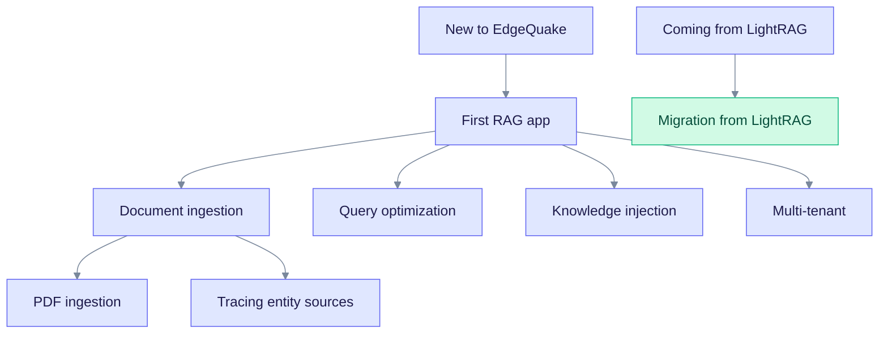

These tutorials teach you EdgeQuake by doing. Each one has numbered steps, copy-paste commands and the output you should expect.

> Product release: v0.32.2. Commands target the REST API under `/api/v1`. The OpenAPI contract at `/swagger-ui` is the source of truth for every field.

## Before you start

You need a running EdgeQuake server. The quickest way is the Docker quickstart in [Getting started](../getting-started/index.md). You also need a chat model and an embedding model; see [Configure LLM providers](../providers/index.md).

All curl examples assume `curl` and `jq` are installed. They share these shell variables:

| Variable | Docker quickstart | `make dev` |
|----------|-------------------|------------|
| `EQ_API` | `http://localhost:8080` | `http://localhost:8090` (run `make status` to see the real port) |
| Web UI | `http://localhost:3000` | `http://localhost:3010` |

## Pick a path

The chart shows which tutorial to read for your goal. Start with the first one if you are new.

Read it top to bottom. An arrow means "read this one next if you want to go deeper".

| Tutorial | You will learn | Time |
|----------|----------------|------|
| [First RAG app](first-rag-app.md) | Create a workspace, upload text, query it, inspect the graph. | 15 min |
| [Document ingestion](document-ingestion.md) | How text becomes chunks, entities and relationships, and which options you can tune. | 20 min |
| [PDF ingestion](pdf-ingestion.md) | Upload a PDF, pick a parser, track progress and fix failures. | 15 min |
| [Query optimization](query-optimization.md) | Choose a query mode and tune retrieval. | 20 min |
| [Tracing entity sources](tracing-entity-sources.md) | Follow an entity back to the chunk and document it came from. | 10 min |
| [Knowledge injection](knowledge-injection.md) | Add glossaries and domain notes that improve answers. | 10 min |
| [Multi-tenant deployment](multi-tenant.md) | Isolate customers with tenants, workspaces and membership. | 25 min |
| [Migration from LightRAG](migration-from-lightrag.md) | Move a LightRAG setup to EdgeQuake. | 20 min |

Times are rough estimates for reading and running the steps. They are not measured.

## Related reading

- [Core concepts](../concepts/index.md) explain Graph-RAG, the knowledge graph and retrieval.
- [Deep dives](../deep-dives/index.md) cover the pipeline internals.
- [Troubleshooting](../troubleshooting/index.md) lists fixes for common errors.
