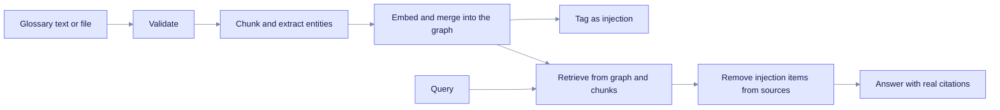

This tutorial shows how to add a glossary to a workspace, check that EdgeQuake processed it and query with it. You also learn the limits and how to update or delete an entry. It is for teams whose documents use domain terms, acronyms or synonyms.

> **You will build:** a glossary entry that helps retrieval match your terms, with its status checked and an update applied.
>
> **You need:** a workspace (see [First RAG app](first-rag-app.md)), `curl`, `jq`, and the variables `EQ_API` and `WORKSPACE_ID`. Knowledge injection is available since v0.8.0 ([issue #131](https://github.com/raphaelmansuy/edgequake/issues/131), [specification](../../specifications/0002_knowledge_injection_issue_131/)).

## What it is

**Knowledge injection** adds short texts such as glossaries, acronym lists and synonym tables to a workspace. EdgeQuake runs them through the normal extraction pipeline. The knowledge graph gains entities such as `OEE` and `OVERALL_EQUIPMENT_EFFECTIVENESS`, and a link between them. Retrieval can then reach documents that use either term.

Injected text is never shown as a citation. Users see answers that use your vocabulary, and the `sources` list contains only real documents.



Read it left to right. The top row runs once per entry. The bottom row runs on every query. Injected items help retrieval, but they are removed from the sources list before it is returned.

## Limits

| Limit | Value |
|-------|-------|
| Text size per entry | 100 KB, for pasted text and uploaded files |
| Name length | 1 to 100 characters. Long file names are cut to 100. |
| File size | 50 MiB |
| File types | `.txt`, `.md`, `.csv`, `.json` (UTF-8 text) |

## 1. Create an entry

Send the JSON body to the injection route. The server reads the workspace from the `X-Workspace-ID` header, so keep the path ID equal to that header.

```bash
curl -s -X PUT "$EQ_API/api/v1/workspaces/$WORKSPACE_ID/injection" \
  -H "Content-Type: application/json" \
  -H "X-Workspace-ID: $WORKSPACE_ID" \
  -d '{
    "name": "Manufacturing Glossary",
    "content": "OEE = Overall Equipment Effectiveness\nTPM = Total Productive Maintenance\nKPI = Key Performance Indicator\n"
  }' | tee inj.json | jq '.'

export INJECTION_ID=$(jq -r '.injection_id' inj.json)
```

Expected output (status `202 Accepted`):

```json
{
  "injection_id": "a1b2c3d4-...",
  "workspace_id": "3f6c1c0e-...",
  "version": 1,
  "status": "processing"
}
```

Each `PUT` creates a new entry with a new ID. To change an existing entry, use `PATCH` (step 4).

To upload a file instead, send it to the file route. If you leave out `name`, the file name without its extension is used.

```bash
curl -s -X PUT "$EQ_API/api/v1/workspaces/$WORKSPACE_ID/injection/file" \
  -H "X-Workspace-ID: $WORKSPACE_ID" \
  -F "name=Domain Glossary" \
  -F "file=@glossary.txt" | jq '.'
```

## 2. Wait for processing

Poll the entry until `status` is `completed` or `failed`:

```bash
curl -s "$EQ_API/api/v1/workspaces/$WORKSPACE_ID/injections/$INJECTION_ID" \
  -H "X-Workspace-ID: $WORKSPACE_ID" \
  | jq '{name, status, version, entity_count, source_type, error}'
```

Expected output:

```json
{
  "name": "Manufacturing Glossary",
  "status": "completed",
  "version": 1,
  "entity_count": 3,
  "source_type": "text",
  "error": null
}
```

An `entity_count` of `0` means the model found nothing to extract. The text may be too short, or the model too small. Add a sentence of context per term, or use a larger model.

## 3. Query

Ask a question that uses the glossary terms:

```bash
curl -s -X POST "$EQ_API/api/v1/query" \
  -H "Content-Type: application/json" \
  -H "X-Workspace-ID: $WORKSPACE_ID" \
  -d '{"query": "What does OEE measure?"}' | jq '{answer, sources: [.sources[] | {source_type, file_path}]}'
```

The answer can use the glossary. No source has the file path `injection`, because those items are filtered out.

## 4. Update, list and delete

| Goal | Call |
|------|------|
| List entries | `GET /api/v1/workspaces/{workspace_id}/injections?limit=20&offset=0` |
| Read one entry | `GET /api/v1/workspaces/{workspace_id}/injections/{injection_id}` |
| Rename | `PATCH` the same path with `{"name": "New name"}`. No reprocessing. |
| Replace the content | `PATCH` the same path with `{"content": "..."}`. The version goes up and the entry is processed again. |
| Delete | `DELETE /api/v1/workspaces/{workspace_id}/injections/{injection_id}` |

Example: replace the content of an entry.

```bash
curl -s -X PATCH "$EQ_API/api/v1/workspaces/$WORKSPACE_ID/injections/$INJECTION_ID" \
  -H "Content-Type: application/json" -H "X-Workspace-ID: $WORKSPACE_ID" \
  -d '{"content": "OEE = Overall Equipment Effectiveness\nMTBF = Mean Time Between Failures\n"}' | jq '.'
```

Deleting an entry removes its graph items, its vectors and its stored chunks.

## 5. Use the Web UI

1. Select a workspace and open **Knowledge** in the sidebar. The page title is **Knowledge Injection**.
2. Select **New Injection**.
3. Use the **Text** tab (a name and the content) or the **File** tab (a `.txt`, `.md`, `.csv` or `.json` file, with an optional name).
4. Select **Create** and wait for the status to change from `processing` to `completed`.

The list shows the status, the number of entities and the source type for each entry. Open an entry to edit its name or content, or to delete it.

## Tips

- Keep one entry per domain, such as manufacturing, finance or legal. Small entries are easier to update.
- Write one definition per line, with the short form first: `OEE = Overall Equipment Effectiveness`.
- Add context when a term is ambiguous: `Bearing (mechanical part, not a compass direction)`.
- Update an entry with `PATCH` instead of creating a new one. Otherwise old and new entries both stay in the graph.
- Injection is not a substitute for documents. Use it for short definitions, and upload long material as [documents](document-ingestion.md).

## Troubleshooting

| Symptom | Cause | Fix |
|---------|-------|-----|
| `400` "Name must be between 1 and 100 characters" | Empty or long name. | Shorten the name. |
| `400` "Injection content exceeds 100KB limit" | Too much text. | Split the text into several entries. |
| `400` "Unsupported file type" | Not `.txt`, `.md`, `.csv` or `.json`. | Convert the file. |
| `status` is `failed` | Model error. Read `error`. | Fix the provider (`edgequake doctor`), then `PATCH` the entry with its content again. |
| The glossary has no effect | `entity_count` is `0`, or the question does not use the terms. | Check step 2 and add context. |

To see injected items in the graph, use `GET /api/v1/graph/entities?search=OEE`. See [Tracing entity sources](tracing-entity-sources.md) to follow them back to the entry.

## What you learned

- An injected glossary improves retrieval, but it never appears as a citation.
- `status` moves from `processing` to `completed` or `failed`. Check it before you query.
- Content changes reprocess the entry. Renames do not.
- Update entries with `PATCH` to avoid duplicate definitions.

## Next steps

- [Document ingestion](document-ingestion.md)
- [REST API reference](../api-reference/rest-api.md)
- [Query optimization](query-optimization.md)
