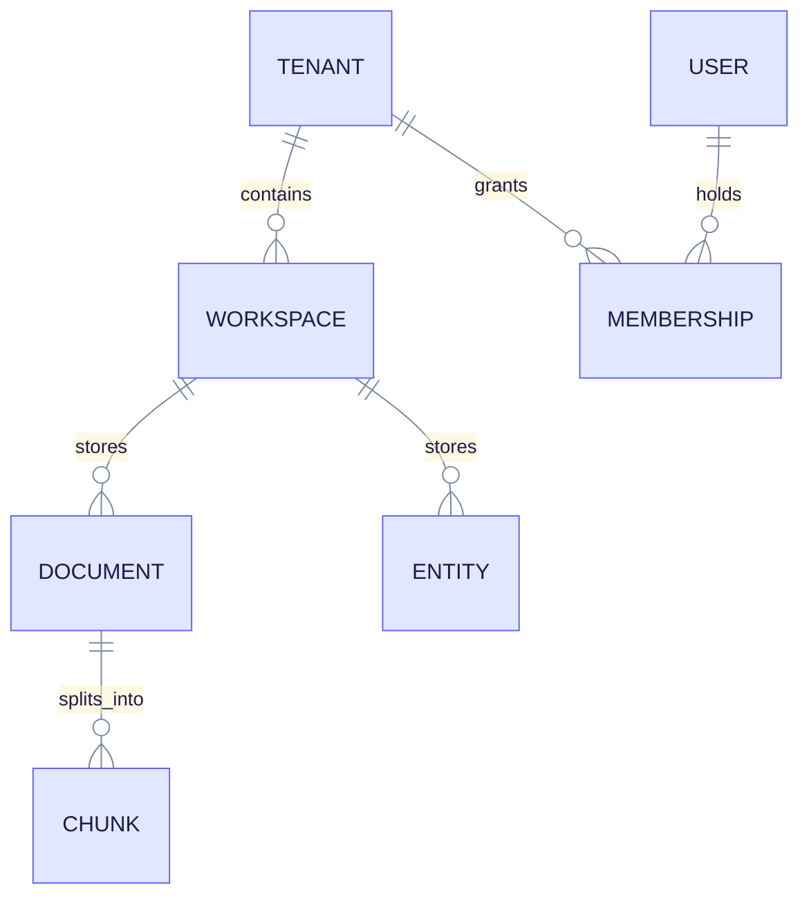
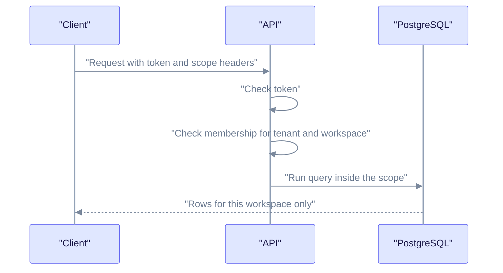
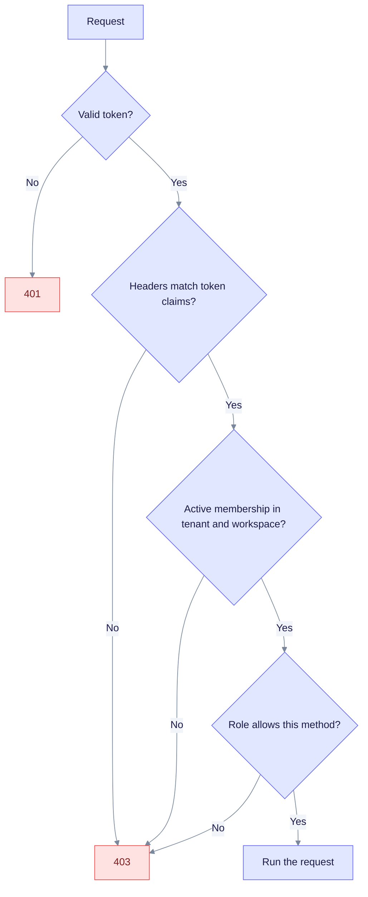
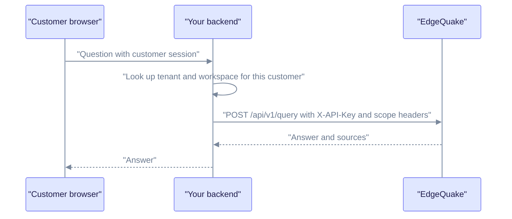

In this tutorial you split one EdgeQuake server between two customers. You create tenants and workspaces, upload data for each, prove that the data is isolated, and learn how access control works when authentication is on.

**Prerequisites:** a running server (see [Getting started](../getting-started/index.md)), `curl` and `jq`. To create tenants with authentication on, you need an admin account; see [Auth quickstart](../operations/auth-quickstart.md).

## The model

A **tenant** is an organization. A **workspace** is an isolated knowledge base inside a tenant. A **user** reaches a workspace through a **membership**. Documents, chunks, vectors and the knowledge graph all belong to exactly one workspace.



Read it as "one TENANT has many WORKSPACEs". A membership links a user to a tenant (and so to its workspaces). Nothing is shared between workspaces.

Pick a layout for your product:

| You are building | Use |
|------------------|-----|
| One app for one team | The default tenant and one or more workspaces. |
| Departments with separate knowledge | One tenant, one workspace per department. |
| A SaaS product | One tenant per customer, one or more workspaces each. |

## How a request finds its data

Two headers select the scope of a request:

| Header | Meaning |
|--------|---------|
| `X-Tenant-ID` | The tenant UUID. |
| `X-Workspace-ID` | The workspace UUID. |

Headers select a scope. They never grant access. With authentication on, the server also checks the caller's token and membership.



Read it top to bottom. A failed check returns `401` or `403` before the database is touched. The full chain, including rate limits, is in [Security best practices](../security/best-practices.md).

The server enforces membership when authentication is on and dev mode is off, or when `EDGEQUAKE_STRICT_TENANT_BIND=true`. In plain dev mode (the Docker quickstart default) there is no check. Never rely on dev mode to separate customers.

## 1. Create two tenants

Creating a tenant needs the platform admin role. Set the base URL and, if auth is on, an admin token:

```bash
export EQ_API=http://localhost:8080
export AUTH_HEADER="Accept: application/json"   # with auth on: "Authorization: Bearer $ADMIN_TOKEN"

create_tenant() {
  curl -s -X POST "$EQ_API/api/v1/tenants" -H "$AUTH_HEADER" -H "Content-Type: application/json" \
    -d "{\"name\": \"$1\", \"slug\": \"$2\", \"plan\": \"pro\"}" | jq -r '.id'
}

export ACME_TENANT=$(create_tenant "Acme Corp" acme)
export GLOBEX_TENANT=$(create_tenant "Globex" globex)
echo "$ACME_TENANT $GLOBEX_TENANT"
```

Expected output: two UUIDs. The route is idempotent by slug: sending the same slug again returns the existing tenant with status `200`.

Tenant fields:

| Field | Meaning |
|-------|---------|
| `name` | Display name (required). |
| `slug` | URL-safe name. Generated from `name` if omitted. |
| `plan` | `free`, `basic`, `pro` or `enterprise`. |
| `default_llm_provider`, `default_llm_model` | Default chat model for new workspaces. |
| `default_embedding_provider`, `default_embedding_model` | Default embedding model for new workspaces. |

List tenants with `GET /api/v1/tenants`. The response has an `items` array. A non-admin sees only tenants where they are a member, when membership scoping is on.

## 2. Create a workspace per tenant

```bash
create_workspace() {   # $1 tenant id, $2 name
  curl -s -X POST "$EQ_API/api/v1/tenants/$1/workspaces" -H "$AUTH_HEADER" \
    -H "Content-Type: application/json" -d "{\"name\": \"$2\"}" | jq -r '.id'
}

export ACME_WS=$(create_workspace "$ACME_TENANT" "Acme Knowledge")
export GLOBEX_WS=$(create_workspace "$GLOBEX_TENANT" "Globex Knowledge")
```

A workspace can set its own models, an entity type list and a document cap (`max_documents`) when you create or update it. See [Document ingestion](document-ingestion.md) for entity types and [Configure LLM providers](../providers/index.md) for models.

List the workspaces of a tenant:

```bash
curl -s "$EQ_API/api/v1/tenants/$ACME_TENANT/workspaces" -H "$AUTH_HEADER" | jq '.items[] | {id, name, slug}'
```

## 3. Load data into each workspace

Send both headers on every data call. This example uploads one text document per tenant:

```bash
upload() {   # $1 tenant, $2 workspace, $3 title, $4 content
  curl -s -X POST "$EQ_API/api/v1/documents" -H "$AUTH_HEADER" -H "Content-Type: application/json" \
    -H "X-Tenant-ID: $1" -H "X-Workspace-ID: $2" \
    -d "{\"title\": \"$3\", \"content\": \"$4\"}" | jq -r '.document_id'
}

upload "$ACME_TENANT" "$ACME_WS" "Acme brief" "Acme Corp builds rocket engines. CEO Jane Park runs the Berlin site."
upload "$GLOBEX_TENANT" "$GLOBEX_WS" "Globex brief" "Globex makes solar panels. CEO Hank Scorpio runs the Cypress Creek site."
```

Wait until both documents are `completed` (see [First RAG app](first-rag-app.md#4-wait-for-processing)).

## 4. Prove the isolation

Ask each workspace about the other tenant's CEO. Each answer must come only from its own data.

```bash
ask() {   # $1 tenant, $2 workspace, $3 question
  curl -s -X POST "$EQ_API/api/v1/query" -H "$AUTH_HEADER" -H "Content-Type: application/json" \
    -H "X-Tenant-ID: $1" -H "X-Workspace-ID: $2" \
    -d "{\"query\": \"$3\"}" | jq -r '.answer'
}

ask "$ACME_TENANT" "$ACME_WS" "Who is the CEO?"        # Jane Park
ask "$ACME_TENANT" "$ACME_WS" "Who is Hank Scorpio?"   # no information
```

Expected: the first answer names Jane Park. The second says it has no information about Hank Scorpio. Entity lists are also separate: `GET /api/v1/graph/entities` with the Acme headers never returns Globex entities.

## 5. Set quotas

Limit how many workspaces a tenant can create. This call needs the admin role:

```bash
curl -s -X PATCH "$EQ_API/api/v1/admin/tenants/$ACME_TENANT/quota" \
  -H "$AUTH_HEADER" -H "Content-Type: application/json" \
  -d '{"max_workspaces": 5}' | jq '.'
```

The value must be between 1 and 10000 and not below the tenant's current workspace count. Per-workspace caps use `max_documents`. Read usage with `GET /api/v1/workspaces/{id}/stats`, which returns `document_count`, `chunk_count`, `entity_count`, `relationship_count` and `storage_bytes`.

## 6. Turn on access control

With authentication on and dev mode off, every non-admin call is checked against memberships. There are two levels of role:

| Level | Values | Meaning |
|-------|--------|---------|
| Account role | `admin`, `user`, `readonly` | Platform-wide ability. `readonly` cannot write. `admin` can create tenants and use `/api/v1/admin/*`. |
| Membership role | `owner`, `admin`, `member`, `readonly` | Ability inside one tenant. |

Create users with `POST /api/v1/users` (admin only) and machine credentials with `POST /api/v1/api-keys`. Send an API key as `X-API-Key`, or a login token as `Authorization: Bearer`.

What the server does for a non-admin request:



Read it top to bottom. Only a request that passes every diamond runs. Platform admins skip the membership check.

> **Known gap.** This release has no REST endpoint that adds a membership. Memberships are created when a user signs in through SSO (OIDC) with the right policy. Without SSO, only platform admins can reach workspaces when binding is on. See [Runtime auth hardening](../operations/runtime-auth-hardening.md) and [Tenancy and providers](../architecture/tenancy-and-providers.md).

## 7. Put your own backend in front

A SaaS product usually does not expose EdgeQuake to browsers. Your backend authenticates the customer, maps the customer to a tenant and workspace, and calls EdgeQuake with a server-side key.



Read it left to right. The browser never sees the API key or the UUIDs, and your backend decides the scope, never the client.

A minimal helper (TypeScript):

```typescript
async function ask(customer: { tenantId: string; workspaceId: string }, query: string) {
  const res = await fetch(`${process.env.EQ_API}/api/v1/query`, {
    method: "POST",
    headers: {
      "Content-Type": "application/json",
      "X-API-Key": process.env.EQ_API_KEY!,
      "X-Tenant-ID": customer.tenantId,
      "X-Workspace-ID": customer.workspaceId,
    },
    body: JSON.stringify({ query }),
  });
  if (!res.ok) throw new Error(`EdgeQuake ${res.status}`);
  return res.json();
}
```

Take `customer` from your own session store, never from request input. The official SDKs wrap the same calls: see [SDKs](../sdks/README.md).

## 8. Clean up

```bash
curl -s -X DELETE "$EQ_API/api/v1/workspaces/$ACME_WS" -H "$AUTH_HEADER"
curl -s -X DELETE "$EQ_API/api/v1/workspaces/$GLOBEX_WS" -H "$AUTH_HEADER"
curl -s -X DELETE "$EQ_API/api/v1/tenants/$ACME_TENANT" -H "$AUTH_HEADER"
curl -s -X DELETE "$EQ_API/api/v1/tenants/$GLOBEX_TENANT" -H "$AUTH_HEADER"
```

Deleting a workspace removes its documents, graph and vectors. Deleting a tenant needs the admin role.

## Troubleshooting

| Symptom | Cause | Fix |
|---------|-------|-----|
| `403` with a valid token | No membership, or headers disagree with the token's tenant. | Check the tenant and workspace IDs; use an admin token for setup. |
| `409` on tenant or workspace create | The slug exists. | Choose another slug. |
| Quota update returns `400` | Value is below the current workspace count, zero, or above 10000. | Send a value in range. |
| Data from another customer appears | Dev mode is on, or you sent the wrong headers. | Turn auth on with dev mode off, or set `EDGEQUAKE_STRICT_TENANT_BIND=true`. |

## Next steps

- [Security best practices](../security/best-practices.md)
- [Runtime auth hardening](../operations/runtime-auth-hardening.md)
- [Tenancy and providers](../architecture/tenancy-and-providers.md)
- [Product limits](../product-limits.md)
