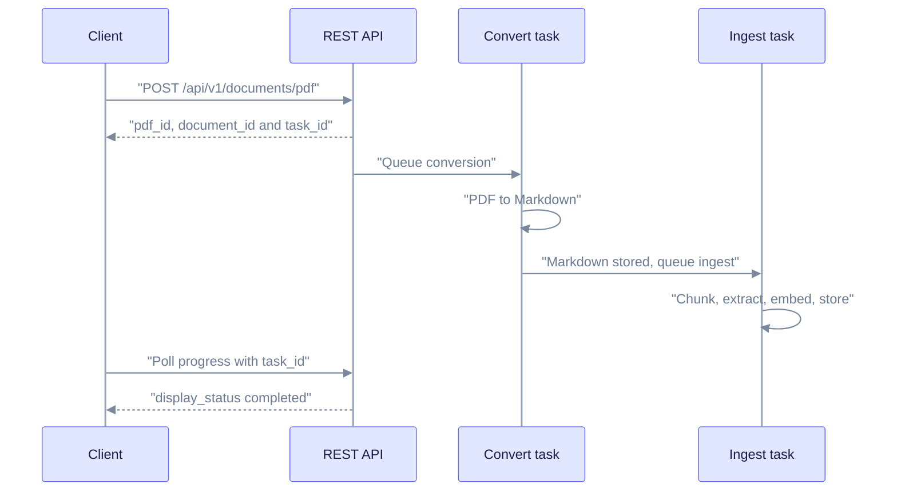
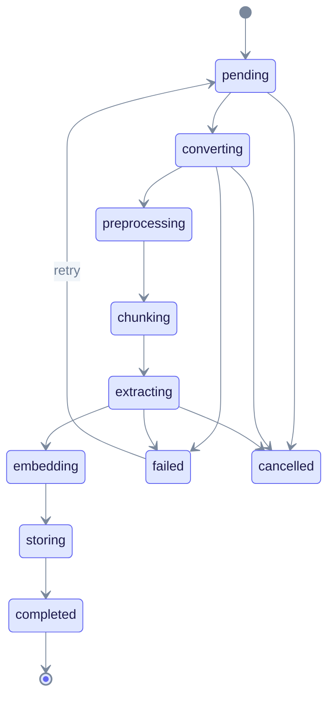

This tutorial shows how to upload a PDF, choose how EdgeQuake converts it to Markdown, follow the background work and query the result. It is for developers who already run EdgeQuake and want to ingest PDFs through the REST API.

> **You will build:** a PDF that you track from upload to a query answer with a source citation.
>
> **You need:** a running server and a workspace (see [First RAG app](first-rag-app.md)), `curl` and `jq`, and the variables `EQ_API` and `WORKSPACE_ID`. The default `vision` parser needs a vision-capable chat model (see [Configure LLM providers](../providers/index.md)). The `edgeparse` parser needs no model.

## How a PDF is processed

A PDF goes through two background tasks. The convert task turns the PDF into Markdown. The ingest task starts only after that Markdown is stored. It then chunks the text, extracts entities, embeds the chunks and writes the graph.



The upload call returns at once, and both tasks run in the background. The convert task can finish while the document is still extracting or embedding. Wait until the document's `display_status` is `completed` before you query it.

## 1. Upload a PDF

Send the file to the PDF route as `multipart/form-data`. `POST /api/v1/documents` accepts JSON text only.

```bash
curl -s -X POST "$EQ_API/api/v1/documents/pdf" \
  -H "X-Workspace-ID: $WORKSPACE_ID" \
  -F "file=@paper.pdf" \
  -F "title=Research Paper" | tee pdf.json | jq '{pdf_id, document_id, status, task_id, estimated_time_seconds}'

export TASK_ID=$(jq -r '.task_id' pdf.json)
export DOC_ID=$(jq -r '.document_id' pdf.json)
```

Expected output (`200 OK`):

```json
{
  "pdf_id": "3b7e...",
  "document_id": "9d1e0a52-...",
  "status": "queued",
  "task_id": "pdf-550e8400-e29b-41d4-a716-446655440000",
  "estimated_time_seconds": 120
}
```

`estimated_time_seconds` is the server's estimate. Your time will differ.

| Field | Use it for |
|-------|-----------|
| `task_id` | Progress and cancel. Use this key for the progress routes. |
| `pdf_id` | The PDF record: download, retry, cancel and delete routes. |
| `document_id` | The document record: document, lineage and download routes. |
| `track_id` | Your own correlation ID, echoed back only if you sent one. It is not a progress key. |
| `duplicate_of` | Set when the same file was already uploaded. `status` is then `duplicate`. Add `-F force_reindex=true` to process it again. |

### Upload fields

| Field | Description |
|-------|-------------|
| `file` | Required. The PDF bytes. |
| `title` | Display title. |
| `metadata` | JSON string with custom data. |
| `pdf_parser_backend` | `vision`, `edgeparse`, `edgeparse-ocr` or `auto`. An unknown value is ignored. |
| `enable_vision` | Use the vision path. Default `true`. |
| `vision_provider`, `vision_model` | Override the vision model for this upload. |
| `vision_reasoning_effort` | Reasoning effort for the vision call. |
| `force_reindex` | Process again even if the checksum matches. Default `false`. |
| `track_id` | Your batch correlation ID. |
| `process_options` | Multimodal processing options. |

To upload several PDFs in one request, send them to `POST /api/v1/documents/pdf/batch`. Repeat the `file` field for each PDF.

## 2. Choose a parser backend

The parser decides how each page becomes Markdown.

| Value | What it does | Needs |
|-------|--------------|-------|
| `vision` (default) | Renders each page and asks a vision model for Markdown. | A vision-capable model. |
| `edgeparse` | Extracts text and tables from born-digital PDFs on the CPU. | Nothing extra. |
| `edgeparse-ocr` | `edgeparse` plus OCR for tables that are images. | Tesseract installed. |
| `auto` | Tries the fast `edgeparse` path first when the PDF has a text layer. Otherwise it uses `vision`. | A vision model for scanned pages. |

Pick `vision` for scans, handwriting and complex layouts. Pick `edgeparse` for clean digital PDFs when you want speed and no model cost.

EdgeQuake uses the first setting it finds, in this order:


Read it left to right and stop at the first box that has a value. To set the workspace default, send `PUT /api/v1/workspaces/{workspace_id}` with `{"pdf_parser_backend": "edgeparse"}`.

To choose the parser for one upload:

```bash
curl -s -X POST "$EQ_API/api/v1/documents/pdf" \
  -H "X-Workspace-ID: $WORKSPACE_ID" \
  -F "file=@scanned.pdf" \
  -F "pdf_parser_backend=vision" \
  -F "vision_provider=ollama" \
  -F "vision_model=<your-vision-model>"
```

The vision provider and model use the first value found, in this order: upload fields, workspace vision settings, tenant vision default, the workspace LLM (only when it is overridden), `EDGEQUAKE_VISION_PROVIDER` and `EDGEQUAKE_VISION_MODEL`, then built-in defaults. `GET /api/v1/config/effective` shows the chain the server uses. More detail: [PDF processing](../deep-dives/pdf-processing.md).

## 3. Track progress

Poll with the `task_id`:

```bash
curl -s "$EQ_API/api/v1/documents/pdf/progress/$TASK_ID" \
  -H "X-Workspace-ID: $WORKSPACE_ID" | jq '{filename, overall_percentage, eta_seconds, is_complete, is_failed, document_id}'
```

Expected output:

```json
{
  "filename": "paper.pdf",
  "overall_percentage": 42.0,
  "eta_seconds": 75,
  "is_complete": false,
  "is_failed": false,
  "document_id": "9d1e0a52-..."
}
```

A `404` means the progress record is gone (the upload finished) or was never created. Read the document instead.

Other ways to follow progress:

| Method | Route |
|--------|-------|
| Server-sent events | `GET /api/v1/documents/pdf/progress/stream/{task_id}` |
| WebSocket | `/ws/progress/{task_id}` (no `/api/v1` prefix) |
| Document list | `GET /api/v1/documents` |

When you need the document state, read the document. It is ready to query when `display_status` is `completed`:

```bash
curl -s "$EQ_API/api/v1/documents/$DOC_ID" -H "X-Workspace-ID: $WORKSPACE_ID" \
  | jq '{display_status, ui_phase, chunk_count, entity_count, error_message}'
```

`ui_phase` is `idle`, `running`, `stopping` or `terminal`. The status lifecycle of a PDF document:



Read it from the start. The middle states are stages that `display_status` reports while the document runs. `gleaning`, `merging` and `summarizing` can also appear. The terminal states are `completed`, `partial_failure`, `failed` and `cancelled`. See [Pipeline progress](../deep-dives/pipeline-progress.md) for the full list.

## 4. Cancel or retry

Cancel by task. Cancellation is cooperative, so a call that is already running finishes first. Until then, `ui_phase` is `stopping`.

```bash
curl -s -X POST "$EQ_API/api/v1/tasks/$TASK_ID/cancel" -H "X-Workspace-ID: $WORKSPACE_ID"
```

Cancelling during conversion or ingestion stops both linked tasks. The final state is `cancelled`, not `failed`. Details: [Ingestion cancel and fairness](../ingestion-cancel-and-fairness.md).

Retry a failed PDF with `POST /api/v1/documents/pdf/{pdf_id}/retry`. The server returns `409` unless the PDF is `failed`.

| Goal | Route |
|------|-------|
| Cancel by PDF ID | `DELETE /api/v1/documents/pdf/{pdf_id}/cancel` |
| Retry a failed conversion | `POST /api/v1/documents/pdf/{pdf_id}/retry` |
| Re-run extraction on a document | `POST /api/v1/documents/reprocess` with `{"document_id": "<id>"}` |
| Re-convert from the stored PDF (spends vision tokens) | Same call with `"mode": "full"` |
| Download the converted Markdown | `GET /api/v1/documents/{id}/download/markdown` |
| Download the original PDF | `GET /api/v1/documents/{id}/download/original` |

## 5. Query the content

```bash
curl -s -X POST "$EQ_API/api/v1/query" \
  -H "Content-Type: application/json" \
  -H "X-Workspace-ID: $WORKSPACE_ID" \
  -d '{"query": "What are the key findings?", "include_references": true}' \
  | jq '{answer, mode, sources: [.sources[] | {document_id, file_path, snippet, start_line, end_line}]}'
```

With `include_references` set, each source points back to its line range in the Markdown. PDF sources also carry page numbers. To search only one document, add `"document_filter": {"document_ids": ["<id>"]}` to the body.

## Troubleshooting

| Symptom | Check | Fix |
|---------|-------|-----|
| `415` on upload to `/documents` | That route takes JSON, not multipart. | Send PDFs to `/documents/pdf`. |
| `400` "Missing 'file' field" | The PDF is not in a `file` part. | Use `-F "file=@paper.pdf"`. |
| Stays in `converting` | Vision model unreachable. | Start the provider, or upload with `pdf_parser_backend=edgeparse`. |
| Empty or garbled Markdown | Wrong model, or a scanned file on `edgeparse`. | Use `vision`; check `GET /api/v1/config/effective`. |
| `failed` | Read `error_message`. | Retry, or see [Common issues](../troubleshooting/common-issues.md). |
| Answers ignore the PDF | Document is not `completed` yet. | Wait for `display_status` to be `completed`. |

## What you learned

- The upload returns at once. Progress is keyed by `task_id`, not by `track_id`.
- The parser comes from the first setting found: upload, workspace, tenant, environment, then `vision`.
- A document is ready to query only when `display_status` is `completed`.
- Cancelling ends in `cancelled`, which is different from `failed`.

## Next steps

- [Document ingestion](document-ingestion.md): chunking and entity types for all documents.
- [Document upload quick reference](../api-reference/document-upload-quick-reference.md)
- [REST API reference](../api-reference/rest-api.md)
