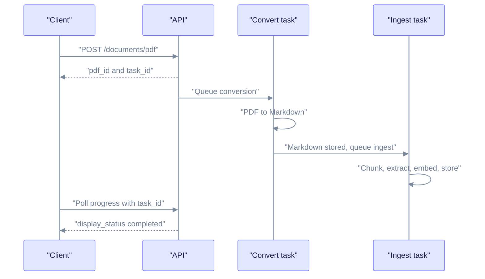
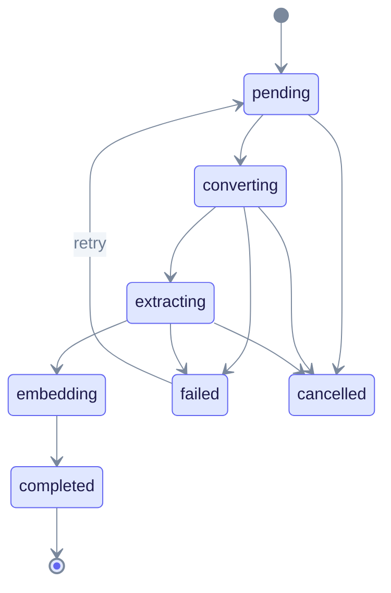

In this tutorial you upload a PDF, pick how it is converted to Markdown, follow its progress and query it.

**Prerequisites:** the setup from [First RAG app](first-rag-app.md): a running server, a workspace, and the variables `EQ_API` and `WORKSPACE_ID`. The default converter uses a vision model, so you also need a vision-capable chat model (see [Configure LLM providers](../providers/index.md)). The `edgeparse` backend needs no model.

## How a PDF is processed

A PDF goes through two separate background tasks. First it is converted to Markdown. Only after the Markdown is stored does a second task chunk it, extract entities and embed it.



Read it from top to bottom. The upload call returns at once. A PDF row can be `Completed` (converted) while the document is still extracting or embedding, so wait for the document's `display_status` to be `completed` before you query.

## 1. Upload a PDF

Use the dedicated PDF route. It accepts `multipart/form-data`. (`POST /api/v1/documents` accepts JSON text only.)

```bash
curl -s -X POST "$EQ_API/api/v1/documents/pdf" \
  -H "X-Workspace-ID: $WORKSPACE_ID" \
  -F "file=@paper.pdf" \
  -F "title=Research Paper" | tee pdf.json | jq '{pdf_id, document_id, status, task_id, estimated_time_seconds}'

export TASK_ID=$(jq -r '.task_id' pdf.json)
```

Expected output (the route answers `200`):

```json
{
  "pdf_id": "3b7e...",
  "document_id": null,
  "status": "processing",
  "task_id": "pdf-550e8400-e29b-41d4-a716-446655440000",
  "estimated_time_seconds": 120
}
```

`estimated_time_seconds` is the server's own estimate. Your time will differ.

| Field | Use it for |
|-------|-----------|
| `task_id` | Progress and cancel. This is the key for the progress store. |
| `pdf_id` | The PDF row: content download, retry, cancel and delete routes. |
| `document_id` | Set after ingestion creates the document row. It can be `null` at first. |
| `track_id` | Your own correlation ID, echoed back only if you sent one. Do not use it for progress. |
| `duplicate_of` | Set when the same file was already uploaded. Add `-F force_reindex=true` to process it again. |

### Upload fields

| Field | Description |
|-------|-------------|
| `file` | Required. The PDF bytes. |
| `title` | Display title. |
| `metadata` | JSON string with custom data. |
| `pdf_parser_backend` | `vision`, `edgeparse`, `edgeparse-ocr` or `auto`. |
| `enable_vision` | Use the vision path (default on). |
| `vision_provider`, `vision_model` | Override the vision model for this upload. |
| `vision_reasoning_effort` | Reasoning effort for the vision call. |
| `force_reindex` | Process again even if the checksum matches. |
| `track_id` | Your batch correlation ID. |
| `process_options` | Multimodal processing options. |

Upload many PDFs at once with `POST /api/v1/documents/pdf/batch`.

## 2. Choose a parser backend

The backend decides how pages become Markdown.

| Value | What it does | Needs |
|-------|--------------|-------|
| `vision` (default) | Renders each page and asks a vision model for Markdown. | A vision-capable model. |
| `edgeparse` | Extracts text and tables from born-digital PDFs on the CPU. | Nothing extra. |
| `edgeparse-ocr` | `edgeparse` plus OCR for tables that are images. | Tesseract installed. |
| `auto` | Starts as `vision`, but may use the fast `edgeparse` path when the PDF has enough text. | A vision model for scanned pages. |

Pick `vision` for scans, handwriting and complex layouts. Pick `edgeparse` for clean digital PDFs when you want speed and no model cost.

EdgeQuake picks the backend from the first source that sets one:


Read it left to right and stop at the first box that has a value. Set the workspace default with `PUT /api/v1/workspaces/{id}` and `{"pdf_parser_backend": "edgeparse"}`.

Per-upload override:

```bash
curl -s -X POST "$EQ_API/api/v1/documents/pdf" \
  -H "X-Workspace-ID: $WORKSPACE_ID" \
  -F "file=@scanned.pdf" \
  -F "pdf_parser_backend=vision" \
  -F "vision_provider=ollama" \
  -F "vision_model=<your-vision-model>"
```

The vision model comes from the upload fields, then the workspace, then `EDGEQUAKE_VISION_PROVIDER` and `EDGEQUAKE_VISION_MODEL`, then the chat model defaults. Run `GET /api/v1/config/effective` to see what the server will use. More detail: [PDF processing](../deep-dives/pdf-processing.md).

## 3. Track progress

Poll with the `task_id`:

```bash
curl -s "$EQ_API/api/v1/documents/pdf/progress/$TASK_ID" \
  -H "X-Workspace-ID: $WORKSPACE_ID" | jq '{filename, overall_percentage, eta_seconds, is_complete, is_failed, document_id}'
```

Expected output:

```json
{
  "filename": "paper.pdf",
  "overall_percentage": 42.0,
  "eta_seconds": 75,
  "is_complete": false,
  "is_failed": false,
  "document_id": null
}
```

A `404` means the progress record is gone (the upload finished) or was never created. Read the document list instead.

Other ways to follow progress:

| Method | Route |
|--------|-------|
| Server-sent events | `GET /api/v1/documents/pdf/progress/stream/{task_id}` |
| WebSocket | `/ws/progress/{task_id}` (no `/api/v1` prefix) |
| Document list | `GET /api/v1/documents` |

Once `document_id` is set, read the document. It is ready to query when `display_status` is `completed`:

```bash
curl -s "$EQ_API/api/v1/documents/$DOC_ID" -H "X-Workspace-ID: $WORKSPACE_ID" \
  | jq '{display_status, ui_phase, chunk_count, entity_count, error_message}'
```

The state machine for a PDF document:



Read it from the start dot. The middle states are examples of what `display_status` reports while the document runs. The terminal states are `completed`, `failed`, `partial_failure` and `cancelled`. See [Pipeline progress](../deep-dives/pipeline-progress.md) for the full list.

## 4. Cancel or retry

Cancel by task. Cancellation is cooperative, so a call that is already running must finish first. During that time `ui_phase` is `stopping`.

```bash
curl -s -X POST "$EQ_API/api/v1/tasks/$TASK_ID/cancel" -H "X-Workspace-ID: $WORKSPACE_ID"
```

Cancelling during conversion or ingestion stops both linked tasks. The final state is `cancelled`, not `failed`. Details: [Ingestion cancel and fairness](../ingestion-cancel-and-fairness.md).

Other routes:

| Goal | Route |
|------|-------|
| Cancel by PDF ID | `DELETE /api/v1/documents/pdf/{pdf_id}/cancel` |
| Retry a failed conversion | `POST /api/v1/documents/pdf/{pdf_id}/retry` |
| Re-run extraction on a document | `POST /api/v1/documents/reprocess` with `{"document_id": "<id>"}` |
| Re-convert from the stored PDF (spends vision tokens) | Same call with `"mode": "full"` |
| Download the converted Markdown | `GET /api/v1/documents/{id}/download/markdown` |
| Download the original PDF | `GET /api/v1/documents/{id}/download/original` |

## 5. Query the content

```bash
curl -s -X POST "$EQ_API/api/v1/query" \
  -H "Content-Type: application/json" \
  -H "X-Workspace-ID: $WORKSPACE_ID" \
  -d '{"query": "What are the key findings?", "include_references": true}' \
  | jq '{answer, mode, sources: [.sources[] | {document_id, file_path, snippet, start_line, end_line}]}'
```

PDF chunks carry page and line positions, so `sources` can point back to the place in the Markdown. To search only one document, add `"document_filter": {"document_ids": ["<id>"]}`.

## Troubleshooting

| Symptom | Check | Fix |
|---------|-------|-----|
| `400` on upload to `/documents` | Wrong route. | Send multipart PDFs to `/documents/pdf`. |
| Stays in `converting` | Vision model unreachable. | Start the provider, or upload with `pdf_parser_backend=edgeparse`. |
| Empty or garbled Markdown | Wrong model or a scanned file on `edgeparse`. | Use `vision`; check `GET /api/v1/config/effective`. |
| `failed` | Read `error_message`. | Retry, or see [Common issues](../troubleshooting/common-issues.md). |
| Answers ignore the PDF | Document is not `completed` yet. | Wait for `display_status` to be `completed`. |

## Next steps

- [Document ingestion](document-ingestion.md): chunking and entity types for all documents.
- [Document upload quick reference](../api-reference/document-upload-quick-reference.md)
- [REST API reference](../api-reference/rest-api.md)
