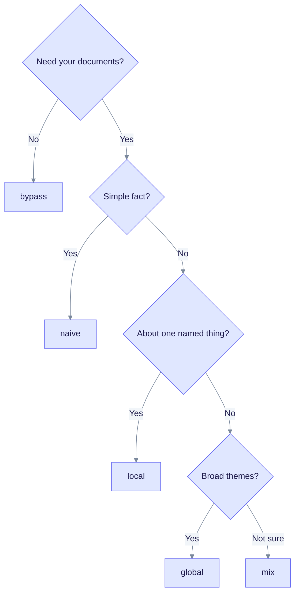

This tutorial shows how to choose a query mode for each kind of question and how to tune retrieval when answers are thin or noisy. It is for users who already have a completed document and want better answers.

> **You will build:** a mode-selection rule and a set of retrieval settings that you can test on your own questions.
>
> **You need:** a workspace with at least one completed document (see [First RAG app](first-rag-app.md)), `curl`, `jq`, and the variables `EQ_API` and `WORKSPACE_ID`.

## How a query runs

Every query follows the same outer steps. Only the retrieval step depends on the mode.


Read it left to right. The mode you choose changes only the third box. The full pipeline is in [Query modes](../deep-dives/query-modes.md).

## The six modes

Set the mode with the `mode` field of `POST /api/v1/query`. Names are case-insensitive.

| Mode | Looks at | Best for |
|------|----------|----------|
| `naive` | Text chunks only, by vector similarity. | Simple fact lookups. |
| `local` | Entities that match the question, their neighbours and linked chunks. | Questions about one named thing. |
| `global` | Relationships that match the question, with related entities and chunks. | Themes and overviews. |
| `hybrid` | `local`, `global` and `naive` together, chunks interleaved. | Questions with several parts. |
| `mix` | The same three searches as `hybrid`, merged with the fusion method in step 4. | General use. **Default.** |
| `bypass` | Nothing. The LLM answers alone. | Chat and "no documents" checks. |

If you send no `mode`, the server uses `mix`. An unknown mode name also falls back to `mix` without an error, so check the `mode` field in the response when you test a new name.

## 1. Choose a mode

Use this chart as a starting point, then test on your own questions in step 2.



Read it from the top and stop at the first answer that fits. When in doubt, keep `mix`.

## 2. Compare modes on one question

Run the same question through each mode and compare the answers and sources. This is the most reliable way to choose.

```bash
QUESTION="How are the key people in the documents connected?"

for MODE in naive local global hybrid mix; do
  echo "== $MODE"
  curl -s -X POST "$EQ_API/api/v1/query" \
    -H "Content-Type: application/json" \
    -H "X-Workspace-ID: $WORKSPACE_ID" \
    -d "{\"query\": \"$QUESTION\", \"mode\": \"$MODE\"}" \
    | jq '{mode, sources: (.sources | length), total_ms: .stats.total_time_ms, answer: (.answer | .[0:160])}'
done
```

Expected output: one block per mode with the mode name, the number of sources, the total time and the start of the answer. The numbers depend on your documents and models. Measure your own rather than relying on published latency figures.

To see only the retrieved evidence, without an answer from the LLM, set `"context_only": true`. To see the final prompt, set `"prompt_only": true`.

## 3. Tune retrieval per request

All fields below are optional parts of the `POST /api/v1/query` body.

| Field | Default | What it does |
|-------|---------|--------------|
| `mode` | `mix` | One of the six modes. Unknown values fall back to `mix`. |
| `max_results` | engine default (20 chunks) | Caps the number of chunks used. Raise it for broad questions, lower it for focused ones. |
| `enable_rerank` | `true` | Re-score chunks after retrieval. |
| `rerank_top_k` | `20` | Chunks kept after reranking. |
| `include_references` | `false` | Adds file path and line information to sources. |
| `include_subgraph` | `true` | Returns the entity subgraph used for the answer. |
| `document_filter` | none | Limit to `document_ids`, a `document_pattern` on titles, or a `date_from` and `date_to` range. |
| `mix_weights` | engine default | Per-request weights `{local, global, naive}` for `mix`. |
| `conversation_history` | none | Earlier turns for multi-turn chat. |
| `llm_provider`, `llm_model` | workspace setting | Use another model for this answer. |
| `system_prompt` | none | Extra instructions added to the base prompt. |

Example: a focused question limited to one document, with references. Set `DOC_ID` first, for example from the upload step in [PDF ingestion](pdf-ingestion.md).

```bash
curl -s -X POST "$EQ_API/api/v1/query" \
  -H "Content-Type: application/json" \
  -H "X-Workspace-ID: $WORKSPACE_ID" \
  -d '{
    "query": "What did the report conclude?",
    "mode": "local",
    "max_results": 10,
    "include_references": true,
    "document_filter": {"document_ids": ["'"$DOC_ID"'"]}
  }' | jq '.sources[] | {document_id, file_path, start_line, end_line, score}'
```

## 4. Tune the mix fusion

`mix` runs the local, global and naive searches, then merges their chunks. The server setting `EDGEQUAKE_MIX_FUSION` picks the merge method.

| `EDGEQUAKE_MIX_FUSION` | Behaviour |
|------------------------|-----------|
| `round_robin` (default) | Takes chunks from each search in turn. |
| `rrf` | Reciprocal rank fusion across the three ranked lists. |
| `max_after_minmax` | Scales each search to 0-1, applies weights, then keeps each chunk's best score. The old name `weighted` still works. |

Weights come from `mix_weights` on the request, or from the server variables `EDGEQUAKE_MIX_LOCAL_WEIGHT`, `EDGEQUAKE_MIX_GLOBAL_WEIGHT` and `EDGEQUAKE_MIX_NAIVE_WEIGHT`. All default to `1.0`. A weight of `0` turns that search off. Weights change the ranking with `rrf` or `max_after_minmax`. With plain round robin they do not reorder results.

```bash
curl -s -X POST "$EQ_API/api/v1/query" \
  -H "Content-Type: application/json" \
  -H "X-Workspace-ID: $WORKSPACE_ID" \
  -d '{"query": "What is the relationship between A and B?", "mode": "mix",
       "mix_weights": {"local": 1.0, "global": 0.5, "naive": 0.5}}' | jq '.answer'
```

## 5. Change server settings

These variables apply to the whole server, not to one request. Set them in the server environment. The [environment reference](../operations/env-reference.md) does not list all of them yet, so the table below covers the ones that change retrieval.

| Variable | Default | Effect |
|----------|---------|--------|
| `EDGEQUAKE_MIN_ENTITY_SCORE` | `0.1` | Drops entities below this similarity. Set `0` to find rare entities named in short queries. |
| `EDGEQUAKE_MIN_RERANK_SCORE` | `0.1` | Drops chunks below this rerank score. |
| `EDGEQUAKE_RERANKER` | BM25 | Set `cross_encoder` for a neural reranker. |
| `EDGEQUAKE_LLM_MAX_TOKENS` | `16384` | Upper bound for the answer length. |
| `EDGEQUAKE_MIX_FUSION` | `round_robin` | Merge method for `mix` (step 4). |
| `EDGEQUAKE_LLM_CACHE` | on | Caches keyword extraction and answers. Set `0` when you benchmark. |

The engine defaults are 60 entities, 60 relationships, 20 chunks and a 30000 token context budget. They are not per-request settings.

## 6. Fix common problems

| Symptom | Likely cause | Try |
|---------|--------------|-----|
| Answer says there is not enough information | Too little context retrieved. | Raise `max_results`; try `mix` or `hybrid`; set `EDGEQUAKE_MIN_ENTITY_SCORE=0`. |
| Answer drifts off topic | Too much weak context. | Use `local` or `naive`; lower `max_results`; add a `document_filter`. |
| Slow answers | Large model or large context. | Lower `max_results`; use a smaller or local model; check the `stats` timings. |
| Named entity not found | Entity score below the threshold, or the name is spelled differently. | Lower `EDGEQUAKE_MIN_ENTITY_SCORE`; search `GET /api/v1/graph/entities?search=<name>`. |
| Same wrong answer after changes | Answer cache. | Set `EDGEQUAKE_LLM_CACHE=0` while testing. |

The `stats` object in every response shows where time went: `embedding_time_ms`, `keyword_time_ms`, `retrieval_time_ms`, `generation_time_ms` and `total_time_ms`. [Query modes](../deep-dives/query-modes.md) explains how to read the debug trail.

## What you learned

- `mix` is the default. Use `local` for one named thing, `global` for themes and `naive` for simple facts.
- Compare two or three modes on the same question before you change server settings.
- Request fields tune one answer. Environment variables tune the whole server.
- Turn off the answer cache while you test, or you will read old answers.

## Next steps

- [Query modes](../deep-dives/query-modes.md): every step and setting in detail.
- [Hybrid retrieval](../concepts/hybrid-retrieval.md)
- [Tracing entity sources](tracing-entity-sources.md): follow a source back to its document.
