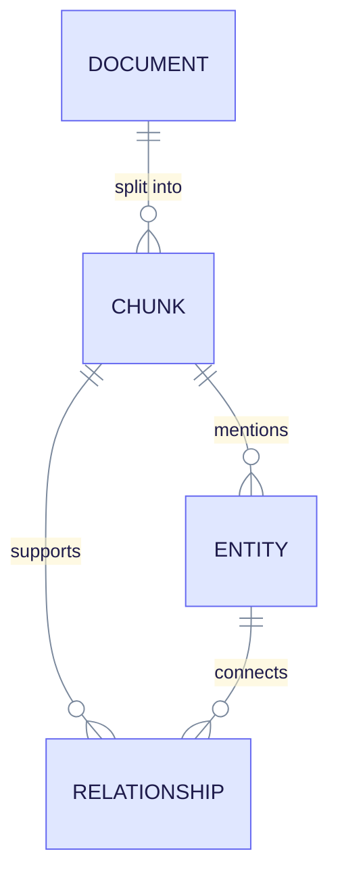
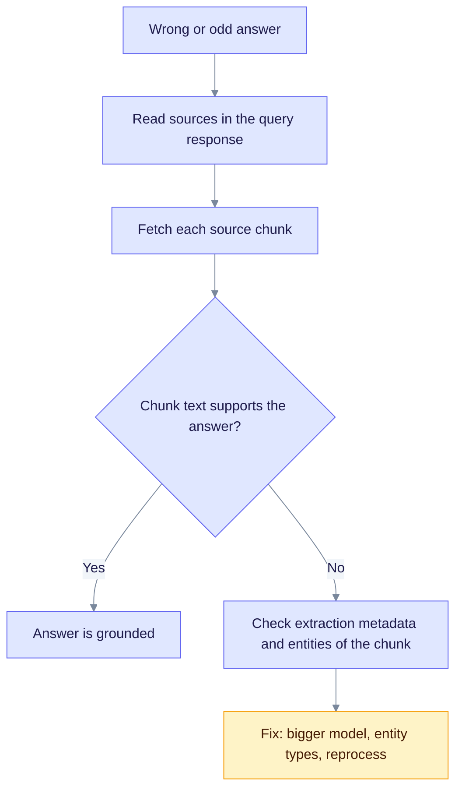

This tutorial shows how to trace facts back to their origin. You start from a query answer, an entity or a document, and end at the chunk and line range that support it. Use it to audit answers and to find bad extractions.

> **You will build:** a trace from a query answer to the source lines behind it.
>
> **You need:** a workspace with at least one completed document (see [First RAG app](first-rag-app.md)), `curl`, `jq`, and the variables `EQ_API` and `WORKSPACE_ID`.

## The lineage chain

Every extracted entity and relationship keeps a link to the chunks it came from. Each chunk belongs to one document. The diagram shows the chain.



Read it from the top: a document is split into chunks, and each chunk can produce entities and relationships. An entity that appears in many chunks keeps all of them as sources.

Pick the endpoint for your starting point:

| You have | Call | You get |
|----------|------|---------|
| A document ID | `GET /api/v1/lineage/documents/{document_id}` | The entities and relationships of the document, each with its source chunks. |
| An entity name | `GET /api/v1/lineage/entities/{entity_name}` | Every document, chunk and line range that mentions it. |
| An entity name or graph node ID | `GET /api/v1/entities/{entity_id}/provenance` | Sources with the source text, plus related entities. |
| A chunk ID | `GET /api/v1/chunks/{chunk_id}` | The chunk text, line range, entities, relationships and extraction metadata. |
| A chunk ID | `GET /api/v1/chunks/{chunk_id}/lineage` | The parent document, position and entity names. |
| A document ID | `GET /api/v1/documents/{document_id}/lineage` | The full lineage tree of the document: chunks, entities and relationships. |

Send `X-Workspace-ID` on every call. Chunk IDs have the form `{document_id}-chunk-{N}`.

## 1. Start from an answer

Run a query with `include_references` and read the `sources` array. Each source has a `source_type` and an `id`. For chunk sources, the `id` is a chunk ID.

```bash
curl -s -X POST "$EQ_API/api/v1/query" \
  -H "Content-Type: application/json" \
  -H "X-Workspace-ID: $WORKSPACE_ID" \
  -d '{"query": "Who leads the NeuralSearch project?", "include_references": true}' \
  | tee answer.json | jq '.sources[] | {source_type, id, document_id, file_path, start_line, end_line, score}'
```

Expected output (values vary):

```json
{
  "source_type": "chunk",
  "id": "9d1e0a52-...-chunk-0",
  "document_id": "9d1e0a52-...",
  "file_path": "sample.md",
  "start_line": 1,
  "end_line": 8,
  "score": 0.82
}
```

Pick a chunk ID and its document ID for the next steps:

```bash
export CHUNK_ID=$(jq -r '[.sources[] | select(.source_type=="chunk")][0].id' answer.json)
export DOC_ID=$(jq -r '[.sources[] | select(.source_type=="chunk")][0].document_id' answer.json)
```

## 2. Read the chunk

```bash
curl -s "$EQ_API/api/v1/chunks/$CHUNK_ID" -H "X-Workspace-ID: $WORKSPACE_ID" \
  | jq '{document_id, document_name, index, start_line, end_line, token_count, entities: [.entities[].name], extraction_metadata}'
```

Expected output:

```json
{
  "document_id": "9d1e0a52-...",
  "document_name": "sample.md",
  "index": 0,
  "start_line": 1,
  "end_line": 8,
  "token_count": 96,
  "entities": ["SARAH_CHEN", "TECHCORP", "NEURALSEARCH"],
  "extraction_metadata": { "model": "...", "gleaning_iterations": 1, "cached": false }
}
```

The `extraction_metadata` block names the model that extracted the chunk. It shows whether gleaning ran and whether the result came from cache. Use it to compare extraction quality between models. Chunks from PDFs also carry `page_start` and `page_end`.

## 3. Trace an entity

Ask where an entity appears. Use the uppercase name shown in the graph.

```bash
curl -s "$EQ_API/api/v1/lineage/entities/SARAH_CHEN" -H "X-Workspace-ID: $WORKSPACE_ID" \
  | jq '{entity_name, entity_type, source_count, sources: [.source_documents[] | {document_id, chunk_ids, line_ranges}]}'
```

Expected output:

```json
{
  "entity_name": "SARAH_CHEN",
  "entity_type": "PERSON",
  "source_count": 1,
  "sources": [
    { "document_id": "9d1e0a52-...", "chunk_ids": ["9d1e0a52-...-chunk-0"], "line_ranges": [{ "start_line": 1, "end_line": 8 }] }
  ]
}
```

The response also has a `description_versions` field. The server currently returns it as an empty list, so do not rely on it. To see the text behind an entity, use the provenance route, which returns the source text of each chunk:

```bash
curl -s "$EQ_API/api/v1/entities/SARAH_CHEN/provenance" -H "X-Workspace-ID: $WORKSPACE_ID" \
  | jq '{total_extraction_count, sources: [.sources[] | {document_name, chunks: [.chunks[] | {chunk_id, source_text}]}], related: [.related_entities[].entity_name]}'
```

The `id` in the provenance route is the normalized entity name (uppercase) or the graph node ID.

## 4. Trace a document

List everything one document contributed to the graph:

```bash
curl -s "$EQ_API/api/v1/lineage/documents/$DOC_ID" -H "X-Workspace-ID: $WORKSPACE_ID" \
  | jq '{chunk_count, extraction_stats, entities: [.entities[] | {name, entity_type, is_shared, source_chunks}]}'
```

`is_shared` is `true` when the entity also appears in another document. `extraction_stats` compares raw extractions with unique ones (`total_entities` and `unique_entities`), so it shows how much merging happened.

To export the lineage as a file, call `GET /api/v1/documents/{document_id}/lineage/export?format=json` or `format=csv`.

## 5. Audit a suspicious answer

When an answer looks wrong, follow this loop:



Read it top to bottom. If the chunk text supports the answer, the fault is in the question or the prompt. If it does not, the extraction is the problem. See [Document ingestion](document-ingestion.md) for the remedies and [Query optimization](query-optimization.md) for retrieval fixes.

Common findings:

| Finding | Meaning | Action |
|---------|---------|--------|
| The source path is `injection` | The text came from [knowledge injection](knowledge-injection.md), not from a document. | Check the entry in `GET /api/v1/workspaces/{workspace_id}/injections`. |
| The same real-world thing has two entity names | Names did not normalize to the same ID. | See [Entity normalization](../deep-dives/entity-normalization.md); merge with `POST /api/v1/graph/entities/merge`. |
| The description mixes unrelated facts | Two things share one name. | Read the provenance `sources` and split the entity. |
| Extraction metadata shows `cached: true` for a bad result | A cached extraction was reused. | Reprocess the document after you fix the cause. |

## What you learned

- Each query source carries a chunk ID, and the chunk ID leads to the document and line range.
- `lineage/entities` and `entities/{id}/provenance` show where an entity came from. Provenance also returns the source text.
- `description_versions` is not populated yet, so the source text is the reliable evidence.
- A `cached: true` extraction can repeat a bad result until you reprocess the document.

## Next steps

- [Lineage tracking architecture](../architecture/lineage-tracking.md)
- [Lineage API reference](../api-reference/lineage-endpoints.md)
- [Knowledge injection](knowledge-injection.md)
