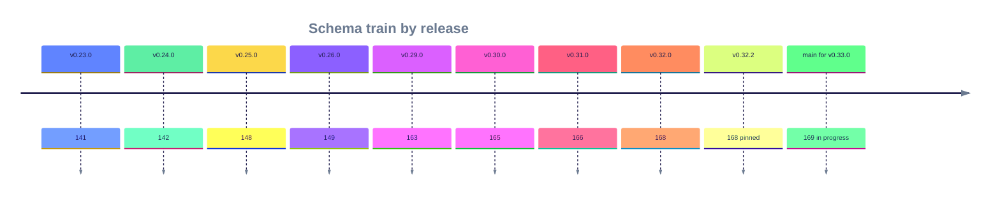

This page lists the highlights of each release from v0.32.2 back to v0.24.0, newest first. Most entries name the schema number, so you can plan a database migration before you upgrade. For the full change list, see the [CHANGELOG](CHANGELOG.md), and for the upgrade steps, see the linked upgrade guide.

## Schema train at a glance

The schema number is the highest migration applied by a release. Releases that do not add a migration keep the previous number.

The timeline shows the schema number each release leaves the database at, from v0.23.0 to the migration on `main`.

Run `edgequake migrate` when you move to a release with a higher number. The [upgrading guide](operations/upgrading.md) covers the steps.

### What's new in 0.32.2

Patch: PDF viewer paints the scrollport (no blank “Page N” placeholder on
long docs); SPEC-161 MCP control surface (async ingest/upload/delete/task);
clippy/fmt clean. Schema stays **168**. SPEC-001 Acc is attested from the
existing 2026-08-15 medical-mid pack.

Upgrade: **[upgrade-to-0.32.2.md](operations/upgrade-to-0.32.2.md)** · changelog: [CHANGELOG.md](CHANGELOG.md).

### What's new in 0.32.1

Patch: typed ANN uses the workspace embedding model key with no preferred→env
fallthrough; graph seed admit runs before popular hubs (local + global Mix);
Ask companion `seed_entity_ids`; projection upserts honor payload `model_id`.
Schema stays **168**. SPEC-001 Acc is attested from the existing 2026-08-15
medical-mid pack; ANN/admit was not re-scored.

Upgrade: **[upgrade-to-0.32.1.md](operations/upgrade-to-0.32.1.md)** · changelog: [CHANGELOG.md](CHANGELOG.md).

### What's new in 0.32.0

Minor: tenant-scoped data access (schema **166 → 168**), scoped query
deadlines and incremental RAG streaming, and PDF convert retries until
`max_retries`. SPEC-001 Acc is attested from the existing 2026-08-15
medical-mid pack; query and graph-read changes in this cut were not
re-scored.

Upgrade: **[upgrade-to-0.32.0.md](operations/upgrade-to-0.32.0.md)** · changelog: [CHANGELOG.md](CHANGELOG.md).

### What's new in 0.31.0

Minor: **SPEC-160** decision extraction as a **preview** (local Ollama System One
model, default `tev1:0.8b`). Chat-LLM extraction stays the default. Schema train
moves **165 → 166**. Gate presets stay **Uncalibrated**. SPEC-001 Acc is attested
from the existing 2026-08-15 medical-mid pack; decision mode is unscored.

Upgrade: **[upgrade-to-0.31.0.md](operations/upgrade-to-0.31.0.md)** · changelog: [CHANGELOG.md](CHANGELOG.md).

### What's new in 0.30.0

Minor: **SPEC-158** enterprise SSO (Keycloak Organizations as tenants, BFF session, opaque handoff). Schema train moves **163 → 165**. A Keycloak image publishes beside the API on the same tag. `make dev` stays auth-off; SSO is opt-in.

Upgrade: **[upgrade-to-0.30.0.md](operations/upgrade-to-0.30.0.md)** · changelog: [CHANGELOG.md](CHANGELOG.md).

### What's new in 0.29.0

Minor: **SPEC-157** side-by-side query companion (citation PDF + answer graph
docked beside chat), **SPEC-155** documents docking workspace + query composer,
**SPEC-156** ingestion fan-out honesty, and `edgeparse-ocr` (Tesseract harvested
into the distroless API image). Schema train moves **162 → 163** (message
feedback columns). Crates.io: `edgequake-llm` **0.10.9**, `edgeparse-core`
**0.3.2**, `edgequake-pdf2md` **0.9.11**.

Upgrade: **[upgrade-to-0.29.0.md](operations/upgrade-to-0.29.0.md)** · changelog: [CHANGELOG.md](CHANGELOG.md).

### What's new in 0.26.4

Patch: SPEC-144 Next.js **16.3.3** Active LTS (August Critical RCEs) + proxy SSOT; SPEC-140/141 list completeness; SPEC-122 bulk-ingest honesty; health poll off by default; distroless API. **No new migration** (schema stays **149**). Pull GHCR `0.26.4` for the patched frontend image.

Upgrade: **[upgrade-to-0.26.4.md](operations/upgrade-to-0.26.4.md)** · changelog: [CHANGELOG.md](CHANGELOG.md).

### What's new in 0.26.3

Patch: SPEC-139 mid-cutover engine (iw2 21000, W3 coverage-sum, KV remainder after 119-before-122); Langfuse 3.22/3.225 isolated OTLP stacks. **No new migration** (schema stays **149**). Pull GHCR `0.26.3` — do not stay on `0.26.1` for leftover DROP OLD copy.

Upgrade: **[upgrade-to-0.26.3.md](operations/upgrade-to-0.26.3.md)** · changelog: [CHANGELOG.md](CHANGELOG.md).

### What's new in 0.26.2

Patch: Langfuse 3.1.x ingestion fallback (SPEC-124), Kubernetes Helm/kind (SPEC-138), SSE/conversation restore, workspace `include_stats`. **No new migration** (schema stays **149**). Pull GHCR `0.26.2`.

Upgrade: **[upgrade-to-0.26.2.md](operations/upgrade-to-0.26.2.md)** · changelog: [CHANGELOG.md](CHANGELOG.md).

### What's new in 0.26.1

Patch: SPEC-137 migrate honesty (`--drop-confirm` alias, unknown apply flags fail-closed, classified DROP abort hints). **No new migration** (schema stays **149**). Pull GHCR `0.26.1` — the `0.26.0` image still has the old CLI.

Upgrade: **[upgrade-to-0.26.1.md](operations/upgrade-to-0.26.1.md)** · leftover 091: [upgrade-to-0.26.0.md](operations/upgrade-to-0.26.0.md) · changelog: [CHANGELOG.md](CHANGELOG.md).

### What's new in 0.26.0

Minor: PDF pack-to-budget (SPEC-135), manuscript page-as-unit convert (SPEC-134), Langfuse dev sibling (SPEC-124), wizard persist honesty (SPEC-101), and reliability (#377, #383–#386 + mig **149**). Crates.io: `edgequake-llm` **0.10.8**, `edgequake-pdf2md` **0.9.11**, `edgequake-sdk` **0.4.0**.

Upgrade: **[upgrade-to-0.26.0.md](operations/upgrade-to-0.26.0.md)** · changelog: [CHANGELOG.md](CHANGELOG.md).

### What's new in 0.25.0

Minor: Langfuse OTLP/HTTP (SPEC-124), structure-aware markdown pack (SPEC-125), provider KV / prompt cache (SPEC-126), PDF layout overlay (SPEC-128 + mig **148**), omit-temperature / Responses API (SPEC-131 / #379), multi-PDF admit honesty (#378), document status CHECK SSOT (#381), fleet-mirror UUID + target-`->` parse (#380 / SPEC-133). Crates.io deps: `edgequake-llm` **0.10.8**, `edgequake-pdf2md` **0.9.11**.

Upgrade: **[upgrade-to-0.25.0.md](operations/upgrade-to-0.25.0.md)** · changelog: [CHANGELOG.md](CHANGELOG.md).

### What's new in 0.24.0

#### Database migration (read this first)

**The API never migrates the database.** Schema changes are an explicit operator step.
Current schema train: **168** (product pin **v0.32.2**). `main` is at **169** for v0.33.0, which is in progress.

| Situation | What to run |
|-----------|-------------|
| **Fresh install** | `edgequake migrate` once, then start the API (`make dev` does this for you) |
| **Any upgrade** | Backup → `migrate check` → `migrate dry-run` → `migrate` → (optional) `migrate drain` → `migrate --confirm-drop` when guard GREEN → start API |
| **Server exits 78** | Schema behind or newer than the binary — run migrate, then restart |

Irreversible drops (**125** KV, **126**/**131** vectors) need `--confirm-drop` and a backup; rollback after that is restore-only. Migration **142** asserts empty leftovers (aborts if rows remain; deferred while residue exists).

**Canonical guide:** **[Upgrading EdgeQuake](operations/upgrading.md)** (works from any published version).  
Legacy cutover notes: [Migrate to v0.23.0+](operations/migrate-to-0.23.md) · [SPEC-091 upgrade runbook](operations/spec091-upgrade-from-v0.22.0.md).

#### Highlights

- **SPEC-104 production data-layer monitors** — StorageInspector uses `workspace_id` + `PostgresConfig` AGE graph SSOT; no `42703` / `42P01` probes; INV-03 dual-read; tenant create **201/200/409**.
- **SPEC-105 legacy cutover assert** — census SSOT; unknown `VECTOR_BACKEND` → typed; migration **142**; mid-upgrade deferral so expandables soft-exit while residue remains.
- **Schema** — migrations through **142** (0.23.0 stopped at **141**).

Also in **0.23.0**: SPEC-091 relational cutover (106–141), LD-15 boot gate, SPEC-094 parse API, SPEC-103 LLM cache, wizard/UX. **0.22.0**: SPEC-090 multi-pool + migrate CLI.
