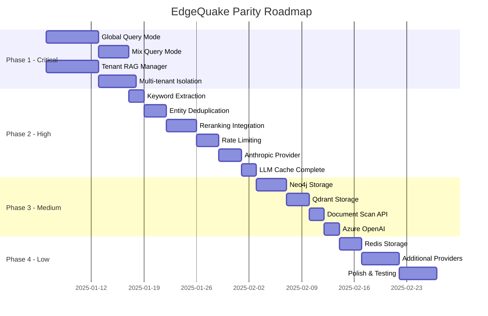
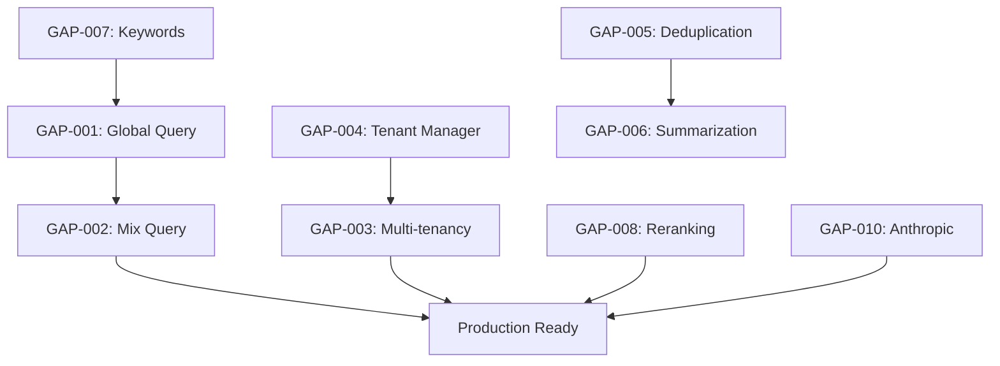

# Parity Roadmap: EdgeQuake Implementation

**Goal:** Achieve feature parity with LightRAG Python implementation  
**Timeline:** Estimated 10-12 weeks  
**Generated:** 2024-12-24

---

## Milestones Overview



---

## Phase 1: Critical Parity (P0 Gaps)

**Objective:** Close all critical gaps to enable production-ready deployment  
**Duration:** 3 weeks  
**Success Criteria:** All query modes functional, multi-tenancy complete

### Milestone 1.1: Global Query Mode

**Gaps Addressed:**

- GAP-001: Query Mode: Global

**Deliverables:**

- [ ] Relationship vector search implementation
- [ ] High-level keyword extraction (LLM-based)
- [ ] Global context aggregation algorithm
- [ ] Global query prompt template
- [ ] Integration tests for global mode

**Dependencies:** None

**Effort Estimate:** 7 person-days

**Technical Approach:**

1. Add `query_global()` method to QueryEngine
2. Implement relationship vector search in VectorStorage trait
3. Create keyword extraction prompt (port from LightRAG)
4. Aggregate context from relationships into coherent summary
5. Integrate with existing streaming infrastructure

**Risks:**

- LLM prompt quality may differ from Python version
- **Mitigation:** Port exact prompts from LightRAG

**Acceptance Criteria:**

- [ ] Global query returns relationship-based context
- [ ] High-level concepts extracted from queries
- [ ] Response quality comparable to LightRAG
- [ ] Performance within 20% of naive mode

---

### Milestone 1.2: Mix Query Mode

**Gaps Addressed:**

- GAP-002: Query Mode: Mix

**Deliverables:**

- [ ] Context merging algorithm
- [ ] Deduplication logic for overlapping sources
- [ ] Token budget allocation across contexts
- [ ] Mix mode tests

**Dependencies:** Milestone 1.1 (Global mode)

**Effort Estimate:** 4 person-days

**Technical Approach:**

1. Execute local and naive queries in parallel
2. Merge entity context with chunk context
3. Deduplicate by source_id
4. Apply unified token budget
5. Generate combined response

**Acceptance Criteria:**

- [ ] Mix mode combines local + naive context
- [ ] No duplicate sources in final context
- [ ] Token limits respected
- [ ] Default mode switch from naive to mix

---

### Milestone 1.3: Tenant RAG Manager

**Gaps Addressed:**

- GAP-004: Tenant RAG Manager

**Deliverables:**

- [ ] TenantRAGManager struct implementation
- [ ] Instance caching with LRU eviction
- [ ] Template configuration inheritance
- [ ] Thread-safe initialization (double-check locking)
- [ ] Tenant access verification

**Dependencies:** None (can parallel with 1.1)

**Effort Estimate:** 7 person-days

**Technical Approach:**

```rust
pub struct TenantRAGManager {
    base_working_dir: PathBuf,
    instances: RwLock<LruCache<(String, String), Arc<EdgeQuake>>>,
    template_config: EdgeQuakeConfig,
    max_cached_instances: usize,
}

impl TenantRAGManager {
    pub async fn get_instance(
        &self,
        tenant_id: &str,
        kb_id: &str,
        user_id: Option<&str>,
    ) -> Result<Arc<EdgeQuake>>;
}
```

**Acceptance Criteria:**

- [ ] Instances cached and reused
- [ ] LRU eviction when cache full
- [ ] Tenant isolation verified
- [ ] Template config applied to new instances

---

### Milestone 1.4: Multi-tenant Isolation

**Gaps Addressed:**

- GAP-003: Multi-tenancy Support
- GAP-037: Tenant/KB Isolation

**Deliverables:**

- [ ] Per-tenant working directories
- [ ] Namespace isolation in storage
- [ ] Tenant middleware for API
- [ ] KB-level data separation

**Dependencies:** Milestone 1.3

**Effort Estimate:** 5 person-days

**Technical Approach:**

1. Modify storage adapters to include tenant/kb prefix
2. Add TenantContext extraction middleware
3. Verify isolation in all storage operations
4. Add integration tests for cross-tenant isolation

**Acceptance Criteria:**

- [ ] Tenant A cannot access Tenant B data
- [ ] KB isolation within tenant
- [ ] API routes respect tenant context
- [ ] Storage paths include tenant/kb prefix

---

## Phase 2: Functional Parity (P1 Gaps)

**Objective:** Implement high-priority features for complete functionality  
**Duration:** 3 weeks  
**Success Criteria:** All P1 gaps closed

### Milestone 2.1: Keyword Extraction

**Gaps Addressed:**

- GAP-007: Keyword Extraction (HL/LL)

**Deliverables:**

- [ ] Keyword extraction prompt
- [ ] GPTKeywordExtractionFormat parser
- [ ] Integration with query engine

**Dependencies:** None

**Effort Estimate:** 2 person-days

**Acceptance Criteria:**

- [ ] High-level keywords extracted
- [ ] Low-level keywords extracted
- [ ] Keywords used in retrieval

---

### Milestone 2.2: Entity Deduplication Enhancement

**Gaps Addressed:**

- GAP-005: Entity Deduplication
- GAP-006: Description Summarization

**Deliverables:**

- [ ] LLM-based description merging
- [ ] Map-reduce summarization
- [ ] Source ID tracking

**Dependencies:** None

**Effort Estimate:** 5 person-days (combined)

**Acceptance Criteria:**

- [ ] Duplicate entities merged correctly
- [ ] Descriptions summarized when exceeding limits
- [ ] Source IDs preserved through merges

---

### Milestone 2.3: Reranking Integration

**Gaps Addressed:**

- GAP-008: Reranking Support

**Deliverables:**

- [ ] Reranker trait definition
- [ ] Cohere reranker implementation
- [ ] Jina reranker implementation
- [ ] Document chunking for long texts

**Dependencies:** None

**Effort Estimate:** 4 person-days

**Acceptance Criteria:**

- [ ] Reranking improves result quality
- [ ] Long documents handled correctly
- [ ] Configurable rerank model

---

### Milestone 2.4: Rate Limiting & Priority Queue

**Gaps Addressed:**

- GAP-011: Async Rate Limiting
- GAP-035: Priority Queue for LLM

**Deliverables:**

- [ ] PriorityAsyncQueue implementation
- [ ] Rate limiter for LLM calls
- [ ] Timeout handling

**Dependencies:** None

**Effort Estimate:** 3 person-days

**Acceptance Criteria:**

- [ ] Concurrent LLM calls limited
- [ ] Priority respected
- [ ] Timeouts handled gracefully

---

### Milestone 2.5: Anthropic Provider

**Gaps Addressed:**

- GAP-010: Anthropic Provider

**Deliverables:**

- [ ] Anthropic LLM provider
- [ ] Claude model support
- [ ] Streaming support

**Dependencies:** None

**Effort Estimate:** 3 person-days

**Acceptance Criteria:**

- [ ] Claude models work for extraction
- [ ] Streaming responses work
- [ ] API key configuration

---

### Milestone 2.6: LLM Cache Completion

**Gaps Addressed:**

- GAP-015: LLM Response Cache

**Deliverables:**

- [ ] Complete cache integration
- [ ] Cache key computation
- [ ] Enable/disable flags

**Dependencies:** None

**Effort Estimate:** 2 person-days

**Acceptance Criteria:**

- [ ] LLM responses cached
- [ ] Cache hit rate measurable
- [ ] Configurable cache behavior

---

## Phase 3: Complete Parity (P2 Gaps)

**Objective:** Implement medium-priority features and storage backends  
**Duration:** 2 weeks

### Milestone 3.1: Neo4j Storage

**Gaps Addressed:**

- GAP-012: Neo4j Storage

**Deliverables:**

- [ ] Neo4j GraphStorage implementation
- [ ] Cypher query templates
- [ ] Connection pooling

**Effort Estimate:** 4 person-days

---

### Milestone 3.2: Qdrant Storage

**Gaps Addressed:**

- GAP-013: Milvus/Qdrant Storage

**Deliverables:**

- [ ] Qdrant VectorStorage implementation
- [ ] Collection management

**Effort Estimate:** 3 person-days

---

### Milestone 3.3: Document Scan API

**Gaps Addressed:**

- GAP-014: Document Scan/Rescan
- GAP-039: Reprocess Failed Docs

**Deliverables:**

- [ ] Directory scanning endpoint
- [ ] Reprocess failed documents endpoint

**Effort Estimate:** 2 person-days

---

### Milestone 3.4: Azure OpenAI Provider

**Gaps Addressed:**

- GAP-028: Azure OpenAI Provider

**Deliverables:**

- [ ] Azure OpenAI configuration
- [ ] Endpoint handling

**Effort Estimate:** 2 person-days

---

## Phase 4: Enhancements (P3+ and Beyond Source)

**Objective:** Implement nice-to-have features and additional providers  
**Duration:** 2 weeks

### Milestone 4.1: Additional Storage Backends

**Gaps Addressed:**

- GAP-024: Redis Storage
- GAP-025: MongoDB Storage

**Effort Estimate:** 6 person-days

---

### Milestone 4.2: Additional LLM Providers

**Gaps Addressed:**

- GAP-030: Gemini Provider
- GAP-031: Bedrock Provider
- GAP-032: HuggingFace Provider

**Effort Estimate:** 5 person-days

---

### Milestone 4.3: Polish & Testing

**Deliverables:**

- [ ] Comprehensive integration tests
- [ ] Performance benchmarks
- [ ] Documentation updates
- [ ] API compatibility verification

**Effort Estimate:** 5 person-days

---

## Dependencies Graph



---

## Resource Requirements

| Phase     | Duration     | Effort             | Skills Required                |
| --------- | ------------ | ------------------ | ------------------------------ |
| Phase 1   | 3 weeks      | 23 person-days     | Rust, RAG algorithms, async    |
| Phase 2   | 3 weeks      | 19 person-days     | Rust, LLM integration, storage |
| Phase 3   | 2 weeks      | 11 person-days     | Rust, databases, APIs          |
| Phase 4   | 2 weeks      | 16 person-days     | Rust, providers, testing       |
| **Total** | **10 weeks** | **69 person-days** | -                              |

---

## Risk Assessment

| Risk                         | Probability | Impact   | Mitigation                          |
| ---------------------------- | ----------- | -------- | ----------------------------------- |
| LLM prompt quality differs   | Medium      | High     | Port exact prompts from LightRAG    |
| Performance regression       | Low         | Medium   | Benchmark against LightRAG          |
| Multi-tenant security issues | Low         | Critical | Security audit, isolation tests     |
| API breaking changes         | Medium      | Medium   | Maintain compatibility layer        |
| Storage backend complexity   | Medium      | Low      | Start with most common (PostgreSQL) |

---

## Success Metrics

| Metric                   | Current | Target | Measurement             |
| ------------------------ | ------- | ------ | ----------------------- |
| Feature Parity %         | 53.8%   | 100%   | Automated feature tests |
| P0 Gaps Closed           | 0/4     | 4/4    | Gap registry            |
| P1 Gaps Closed           | 0/8     | 8/8    | Gap registry            |
| Query Mode Coverage      | 2/6     | 6/6    | API tests               |
| Provider Coverage        | 2/13    | 6/13   | Provider tests          |
| Storage Backend Coverage | 2/8     | 4/8    | Storage tests           |

---

## Appendices

### A. Gap-to-Milestone Mapping

| Gap ID  | Milestone | Phase   |
| ------- | --------- | ------- |
| GAP-001 | 1.1       | Phase 1 |
| GAP-002 | 1.2       | Phase 1 |
| GAP-003 | 1.4       | Phase 1 |
| GAP-004 | 1.3       | Phase 1 |
| GAP-005 | 2.2       | Phase 2 |
| GAP-006 | 2.2       | Phase 2 |
| GAP-007 | 2.1       | Phase 2 |
| GAP-008 | 2.3       | Phase 2 |
| GAP-009 | 2.2       | Phase 2 |
| GAP-010 | 2.5       | Phase 2 |
| GAP-011 | 2.4       | Phase 2 |
| GAP-012 | 3.1       | Phase 3 |
| GAP-013 | 3.2       | Phase 3 |
| GAP-014 | 3.3       | Phase 3 |
| GAP-015 | 2.6       | Phase 2 |

### B. Detailed Effort Estimates

| Milestone           | Tasks      | Estimate |
| ------------------- | ---------- | -------- |
| 1.1 Global Query    | 5 subtasks | 7 days   |
| 1.2 Mix Query       | 4 subtasks | 4 days   |
| 1.3 Tenant Manager  | 5 subtasks | 7 days   |
| 1.4 Isolation       | 4 subtasks | 5 days   |
| 2.1 Keywords        | 3 subtasks | 2 days   |
| 2.2 Dedup + Summary | 3 subtasks | 5 days   |
| 2.3 Reranking       | 4 subtasks | 4 days   |
| 2.4 Rate Limiting   | 3 subtasks | 3 days   |
| 2.5 Anthropic       | 3 subtasks | 3 days   |
| 2.6 LLM Cache       | 3 subtasks | 2 days   |

### C. Test Plan for Parity Verification

1. **Query Mode Tests:**

   - Test each mode with same queries as LightRAG
   - Compare response quality (manual review)
   - Verify context retrieval accuracy

2. **Multi-tenancy Tests:**

   - Create multiple tenants and KBs
   - Verify isolation between tenants
   - Test concurrent access

3. **Provider Tests:**

   - Test each LLM provider with extraction
   - Verify streaming works
   - Test error handling

4. **Storage Tests:**
   - Test each storage backend
   - Verify data persistence
   - Test concurrent access
