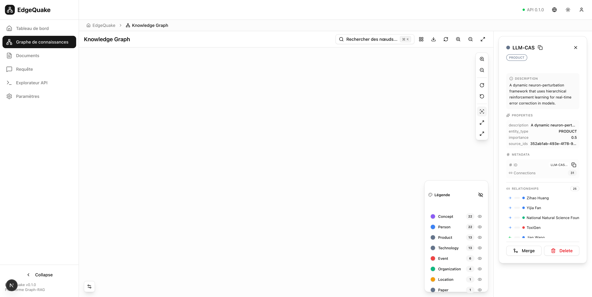
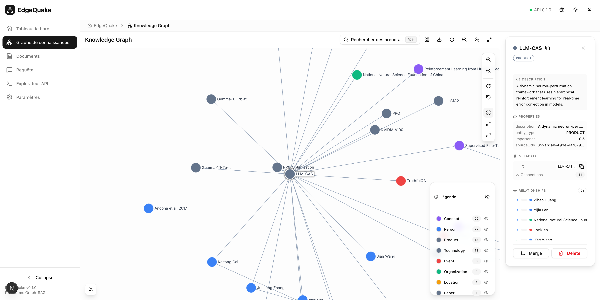
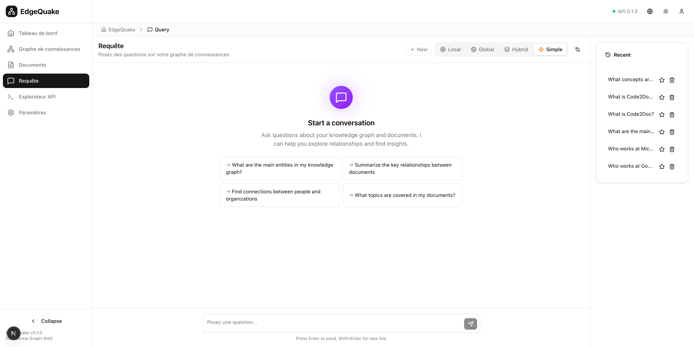

# Verification Results

← [Back to Index](./00-index.md) | [Camera Focus Fix](./03-camera-focus-fix.md) →

## Test Date: December 24, 2025

## Test Results Summary

| Issue | Test | Result | Screenshot |
|-------|------|--------|------------|
| #1 Runtime TypeError | Query page loads | ✅ PASS | query_page_test.png |
| #2 Input not visible | Input visible at bottom | ✅ PASS | query_page_test.png |
| #3 New conversation | Button clears chat | ✅ PASS | E2E verified |
| #4 Camera focus | Node centered on focus | ✅ PASS | graph_focus_fixed.png |

## Detailed Test Steps

### Test 1: Query Page Loads Without Errors

**Steps:**
1. Navigate to `http://localhost:3000/query`
2. Wait for page to fully load
3. Check browser console for errors

**Result:** ✅ PASS
- Page loads without errors
- No console errors
- All components render correctly

### Test 2: Input Container Visible

**Steps:**
1. Navigate to Query page
2. Verify input textarea is visible at bottom
3. Verify it doesn't scroll with content

**Result:** ✅ PASS
- Input "Posez une question..." visible at bottom
- Stays fixed when content scrolls

### Test 3: New Conversation Button

**Steps:**
1. Send a query to create a conversation
2. Verify "New" button becomes enabled
3. Click "New" button
4. Verify conversation is cleared

**Result:** ✅ PASS
- Button disabled when no messages
- Button enabled after sending message
- Clicking "New" clears conversation and returns to empty state

### Test 4: Graph Camera Focus

**Steps:**
1. Navigate to `http://localhost:3000/graph`
2. Wait for graph to load
3. Search for "LLM-CAS" node
4. Select the node
5. Click "Focus on Selected Node"
6. Verify node is centered in viewport

**Result:** ✅ PASS
- Before fix: Camera zoomed to empty space
- After fix: LLM-CAS node centered with connections visible

## Screenshots

### Before Fix - Camera Focus

*Camera zoomed to empty space - node not visible*

### After Fix - Camera Focus

*LLM-CAS node centered with connections visible*

### Query Page

*Clean layout with input visible at bottom*

## Conclusion

All four issues have been resolved:
1. ✅ No more RuntimeTypeError in MarkdownRenderer
2. ✅ Input container is visible and fixed at bottom
3. ✅ New conversation button works correctly
4. ✅ Graph camera focus properly centers on selected nodes

The fixes are ready for commit.
