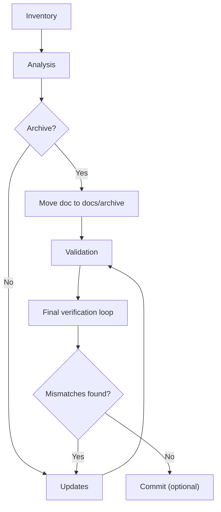
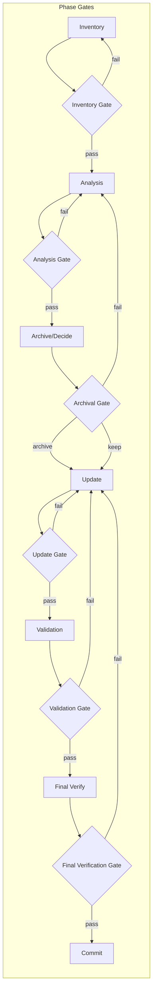

## Critical: Session Persistence

Maintain docs/craftpad.md as your working scratchpad throughout this task. Update it immediately upon each discovery—do not batch updates. Your session may be interrupted or context compressed at any time.

### Scratchpad Structure

markdown

# Documentation Sync - Working Notes

## Last Updated: [timestamp]

## Current Phase: [discovery|analysis|update|review]

## Current File: [path]

### Completed

- [file]: [status]

### Findings

#### Outdated

- [doc_file:section]: [issue] → [correction needed]

#### Missing

- [topic]: [source file reference]

#### To Archive

- [doc_file]: [reason]

### Pending Actions

- [ ] [action item]

---

## Task

Synchronize documentation in docs/ with the current implementation of the codebase.

---

## Context

Fill in (and update as you discover more):

| Component     | Stack    | Location            |
| ------------- | -------- | ------------------- |
| Frontend      | [stack]  |  ./edgequake_webui/ |
| Backend       | [stack]  | ./edgequake         |
| Documentation | Markdown | ./docs/             |

---

## Process

### Process Overview (ASCII)

```
Inventory → Analyze → (Archive?) → Update → Validate → Final Verify Loop → (Commit)
	^                                                     |
	|------------------ if diffs found: fix + re-check ----|
```

### Process Overview (Mermaid)



### Phase Gates

Each phase has an explicit **gate** that must be passed before proceeding. A gate is a short checklist of objective criteria and required evidence; failures send the work back to the previous phase for correction.

#### Gate format (use for each phase)

- **Gate**: Name of gate
- **Entry**: What must be present to attempt the gate (documents, code changes, craftpad state)
- **Exit** (pass): Clear, testable criteria that must be met to proceed
- **Evidence**: Artifacts to attach to the craftpad (search outputs, test results, screenshots, diffs)
- **If fail**: The corrective action (where to go back and which owner to notify)

---

#### Inventory Gate

- **Entry**: `docs/` file list and initial mapping to source components in `docs/craftpad.md` exists.
- **Exit (pass)**: Every document is either mapped to a source or marked as orphan; missing topics are listed with owner (or flagged as backlog).
- **Evidence**: `docs/craftpad.md` inventory table, `rg "path/to/component"` hits summary.
- **If fail**: Complete mapping and re-run Inventory Gate.

#### Analysis Gate

- **Entry**: Inventory Gate passed; `docs/craftpad.md` has per-component findings.
- **Exit (pass)**: For each mapped source: at least one documented claim exists or a documented gap with owner assigned.
- **Evidence**: Per-file findings in `docs/craftpad.md`, test snippets or code references for at least 80% of claims.
- **If fail**: Continue analyzing sources; escalate ambiguous areas to code owners.

#### Archival Gate

- **Entry**: Candidate archival files identified in Analysis Phase.
- **Exit (pass)**: Archived files moved to `docs/archive/` with header containing date + reason; cross-references updated or removed.
- **Evidence**: `git mv` or archive action recorded, updated backlinks fixed, `docs/craftpad.md` log entry.
- **If fail**: Re-open analysis—verify that archive decision was correct.

#### Update Gate

- **Entry**: Files selected for update, with an initial set of proposed edits in a working branch or local edits.
- **Exit (pass)**: All documented changes made; code examples tested against current code; examples compile/run where appropriate.
- **Evidence**: Inline code examples validated (commands run, examples produce expected output), updated file diffs, `docs/craftpad.md` updated.
- **If fail**: Fix the examples or update the source code, then re-run Update Gate.

#### Validation Gate

- **Entry**: Update Gate passed.
- **Exit (pass)**: No dead links; `docs/craftpad.md` shows zero unresolved findings; basic linting/formatting passes.
- **Evidence**: Link-checker output or `rg` results, `markdownlint`/formatter run, `docs/craftpad.md` status.
- **If fail**: Address failures and re-run Validation Gate.

#### Final Verification Gate

- **Entry**: Validation Gate passed and PR or changes are ready for final verification.
- **Exit (pass)**: Final verification loop (see Phase 6) completes with zero mismatches between modified docs and authoritative code/config sources.
- **Evidence**: Short checklist per-file signed off in `docs/craftpad.md` and diff-free verification outputs (e.g., `rg`/`cargo`/`package.json` checks) attached to the craftpad entry.
- **If fail**: Apply fixes to docs (or code), document the fix in `docs/craftpad.md`, repeat the final verification loop until the gate passes.

#### Commit Gate

- **Entry**: Final Verification Gate passed.
- **Exit (pass)**: Commit message follows the template, CI (if applicable) passes smoke checks, and PR description includes the craftpad summary + evidence.
- **Evidence**: Commit/PR with linked `docs/craftpad.md` entry and successful CI run.
- **If fail**: Fix issues, re-run any relevant gates, and re-submit.

---

### Phase Gates (Mermaid)



### Phase 1: Inventory

_Gate_: **Inventory Gate** — Exit: every document is mapped to source or marked orphan. Owner: Documentation author.

1. List all files in ./docs/.
2. List all files in each source directory (frontend/backend/services).
3. Map each documentation file to one or more source components (or mark as orphan).
4. Record inventory in docs/craftpad.md.

### Phase 2: Analysis

_Gate_: **Analysis Gate** — Exit: each mapped source has at least one documented claim or an assigned gap. Owner: Documentation author + code reviewer.
For each relevant source file/module:

1. Extract: public interfaces (APIs/CLIs), components, data models, configuration, dependencies, and key algorithms.
2. Compare against corresponding documentation.
3. Log discrepancies immediately to docs/craftpad.md under Findings.

Outdated Criteria:

- References removed/renamed functions, endpoints, commands, or components
- Describes deprecated configuration options
- Shows incorrect signatures, parameters, or response formats
- Lists outdated dependencies or version requirements

### Phase 3: Archival

_Gate_: **Archival Gate** — Exit: files to archive are confirmed and cross-references handled. Owner: Documentation author + maintainer.
For documentation files meeting any criteria below:

1. Move to ./docs/archive/ (create if needed).
2. Prepend to file:
<!-- Archived: [date] - Reason: [reason] -->
3. Log action in docs/craftpad.md.

Archive Criteria:

- Documents features no longer in the codebase
- Superseded by newer documentation
- References removed components with no replacement

### Phase 4: Updates

_Gate_: **Update Gate** — Exit: documentation edits completed and examples validated; Owner: Documentation author (+ test verification by dev).
For each documentation file requiring changes:

1. Update docs/craftpad.md with current file and phase.
2. Revise outdated sections using source code as the ground truth.
3. Add missing documentation for undocumented behavior.
4. Remove references to archived/deprecated items.
5. Verify code examples match current implementation.
6. Document algorithms precisely when they materially affect behavior (inputs, outputs, invariants, edge cases).

Style Requirements:

- Maintain existing tone and formatting conventions
- Use present tense for current functionality
- Include source file references for technical claims (e.g., path/to/file.ext:line when available)

### Phase 5: Validation

_Gate_: **Validation Gate** — Exit: no unresolved findings, links valid, and basic lint passes. Owner: Documentation reviewer.

1. Cross-check all updated files against docs/craftpad.md findings.
2. Verify no dead links or references to archived content.
3. Confirm docs/craftpad.md shows no unresolved findings.

### Phase 6: Final Verification Loop (must converge)

_Gate_: **Final Verification Gate** — Exit: per-file sign-off with zero mismatches. Owner: Documentation author + code owner.

Goal: Ensure each modified document matches source code + configuration exactly.

For each modified documentation file (repeat until no diffs are found):

1. List every technical claim in the doc that can be verified (endpoints, CLI flags, env vars, config keys, default values, ports, versions, file paths, algorithms, example payloads).
2. Locate the authoritative source of truth:
   - Rust: relevant `Cargo.toml`, `*.rs`, feature flags, examples, tests
   - Web UI: `package.json`, `next.config.*`, `vite.config.*`, API client code
   - Configuration: `.env.example`, config loaders, docs config reference
3. Verify each claim against the source:
   - API routes: path, method, query/body shape, status codes
   - Config: key names, defaults, required/optional, allowed values
   - Versions: toolchains, runtime versions, dependency major versions
4. If any mismatch is found, update the doc immediately and log the correction in `docs/craftpad.md`.
5. Re-run the checks for that same doc until you can assert: “No remaining mismatches.”

Practical check techniques (pick the simplest that works):

- `rg "<endpoint or config key>"` in the codebase to confirm spelling and usage
- Verify example commands exist in `Makefile`, `README`, or `examples/`
- Sanity-check any version claims against `Cargo.lock`, `package.json`, and toolchain files

### Phase 6: Commit (if applicable)

If changes are to be committed, use this message format:

docs(project_slug): synchronize docs with current implementation

Updated:

- [file]: [changes]

Archived:

- [file]: [reason]

Added:

- [file]: [coverage]

---

## Constraints

- Read-only on source code directories (unless explicitly permitted)
- Do not delete docs files—archive instead
- Flag (do not guess) ambiguous implementation details in docs/craftpad.md

---

## Completion Criteria

- [ ] All source files analyzed
- [ ] All documentation files reviewed
- [ ] Outdated files archived with reason
- [ ] Active documentation reflects current implementation
- [ ] docs/craftpad.md shows no unresolved findings
- [ ] Final verification loop completed (all modified docs match code/config with no remaining mismatches)
- [ ] All phase gates passed (Inventory, Analysis, Archival, Update, Validation, Final Verification, Commit)
- [ ] Changes committed with descriptive message
