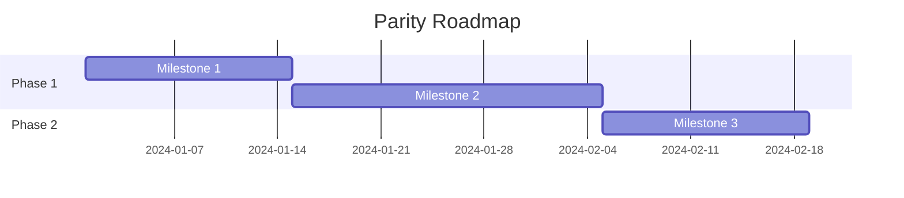
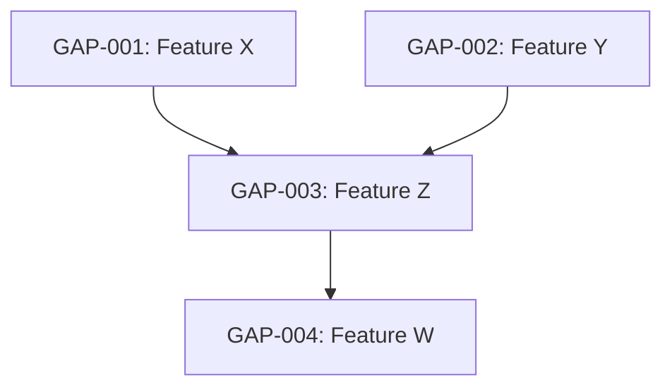

# Cross-Language Implementation Gap Analysis Prompt

```markdown
## Critical: Session Persistence

Maintain `gap_analysis/gap-analysis-scratchpad.md` as your working scratchpad throughout this task. Update it immediately upon each discovery—do not batch updates. Your session may be interrupted or context compressed at any time.

### Scratchpad Structure
```
# Gap Analysis - Working Notes

## Last Updated: [timestamp]
## Current Phase: [inventory|mapping|analysis|roadmap|review]
## Current File: [path]

### Progress
- Source files analyzed: [X/Y]
- Target files analyzed: [X/Y]
- Features mapped: [X/Y]

### Feature Registry
| ID | Feature Name | Source Status | Target Status | Gap Type |
|----|--------------|---------------|---------------|----------|
| F001 | [name] | ✅ complete | ⚠️ partial | [type] |

### Completed
- [file]: [status]

### Findings
#### Parity Achieved
- [feature]: [source file] ↔ [target file]

#### Gaps Identified
- [GAP-XXX]: [feature] - [severity] - [description]

#### Target Exceeds Source
- [feature]: [description of enhancement]

#### Ambiguous/Needs Clarification
- [item]: [question]

### Pending Actions
- [ ] [action item]
```

---

## Task

Perform a comprehensive gap analysis between a source implementation and a target implementation in a different language. Identify feature parity, gaps, and enhancements. Produce a prioritized roadmap to achieve or exceed source functionality.

---

## Context

| Role | Language | Stack | Location |
|------|----------|-------|----------|
| Source (Reference) | {{SOURCE_LANGUAGE}} | {{SOURCE_STACK}} | `{{SOURCE_PATH}}` |
| Target (Implementation) | {{TARGET_LANGUAGE}} | {{TARGET_STACK}} | `{{TARGET_PATH}}` |
| Documentation | Markdown | - | `{{GAP_ANALYSIS/_PATH}}` |

**Source Implementation:** {{SOURCE_DESCRIPTION}}

**Target Implementation:** {{TARGET_DESCRIPTION}}

**Analysis Goal:** {{ANALYSIS_GOAL}}

---

## Feature Classification Schema

### Feature Categories

| Category | Code | Description | Examples |
|----------|------|-------------|----------|
| Core | `CORE` | Essential functionality defining the system | Main algorithms, primary data models |
| API | `API` | External interfaces and contracts | Endpoints, SDK methods, CLI commands |
| Data | `DATA` | Data handling and persistence | Models, schemas, serialization |
| Integration | `INTG` | External system connections | Third-party APIs, databases, queues |
| Security | `SEC` | Authentication, authorization, protection | Auth flows, encryption, validation |
| Performance | `PERF` | Optimization and efficiency features | Caching, pooling, async operations |
| Observability | `OBS` | Monitoring and debugging | Logging, metrics, tracing |
| Configuration | `CFG` | System configuration and tuning | Env vars, config files, feature flags |
| Error Handling | `ERR` | Failure modes and recovery | Exceptions, retries, fallbacks |
| Testing | `TEST` | Quality assurance infrastructure | Unit tests, integration tests, mocks |

### Gap Severity Levels

| Severity | Code | Impact | Definition |
|----------|------|--------|------------|
| Critical | `P0` | Blocker | Feature is essential; target cannot be used without it |
| High | `P1` | Major | Feature is important for most use cases |
| Medium | `P2` | Moderate | Feature is useful but has workarounds |
| Low | `P3` | Minor | Feature is nice-to-have or edge case |
| Enhancement | `P4` | Positive | Target exceeds source capability |

### Gap Types

| Type | Code | Description |
|------|------|-------------|
| Missing | `MISSING` | Feature exists in source, absent in target |
| Partial | `PARTIAL` | Feature exists but incomplete or limited |
| Divergent | `DIVERGENT` | Feature exists but behaves differently |
| Architectural | `ARCH` | Structural difference affecting implementation |
| Idiomatic | `IDIOM` | Language-specific approach differs |
| Performance | `PERF` | Functional parity but performance differs |
| API Surface | `SURFACE` | Interface differs (naming, signatures, etc.) |

---

## Feature Documentation Template

### For Each Identified Feature

```markdown
## Feature: [F-XXX] [Feature Name]

**Category:** [CORE|API|DATA|INTG|SEC|PERF|OBS|CFG|ERR|TEST]
**Priority:** [P0|P1|P2|P3|P4]

### Source Implementation

**Location:** `[file:function/class]` (lines X-Y)
**Language:** {{SOURCE_LANGUAGE}}

#### Description
[What this feature does in the source implementation]

#### Interface
```{{SOURCE_LANGUAGE}}
// Key signatures, types, or API surface
function_signature(params): return_type
```

#### Behavior
- [Key behavior 1]
- [Key behavior 2]
- [Edge case handling]

#### Dependencies
- [Internal dependency 1]
- [External dependency 1]

### Target Implementation

**Location:** `[file:function/class]` (lines X-Y) | `NOT IMPLEMENTED`
**Language:** {{TARGET_LANGUAGE}}

#### Current State
[Description of current implementation state, or "Not implemented"]

#### Interface (if exists)
```{{TARGET_LANGUAGE}}
// Current signatures, types, or API surface
function_signature(params): return_type
```

#### Behavior Differences
- [Difference 1]
- [Difference 2]

### Gap Analysis

**Status:** [✅ Parity | ⚠️ Partial | ❌ Missing | 🔄 Divergent | ⬆️ Exceeds]
**Gap Type:** [MISSING|PARTIAL|DIVERGENT|ARCH|IDIOM|PERF|SURFACE]
**Severity:** [P0|P1|P2|P3|P4]

#### Detailed Gap Description
[Precise description of what is missing or different]

#### Impact Assessment
- **Functional Impact:** [What users/systems cannot do]
- **Integration Impact:** [Effect on other features]
- **Migration Impact:** [Effect on users migrating from source]

#### Root Cause
[Why does this gap exist? Language limitation, not yet implemented, architectural decision, etc.]

### Remediation

#### Recommended Approach
[How to close this gap]

#### Implementation Notes
```{{TARGET_LANGUAGE}}
// Suggested implementation pattern or pseudocode
```

#### Effort Estimate
- **Complexity:** [Low|Medium|High|Very High]
- **Estimated Time:** [hours/days/weeks]
- **Dependencies:** [What must be done first]

#### Acceptance Criteria
- [ ] [Specific testable criterion 1]
- [ ] [Specific testable criterion 2]
- [ ] [Behavioral parity verified]

### Test Cases for Parity

| Test Case | Source Behavior | Target Behavior | Status |
|-----------|-----------------|-----------------|--------|
| [case 1] | [expected] | [actual/expected] | [✅❌⚠️] |
| [case 2] | [expected] | [actual/expected] | [✅❌⚠️] |
```

---

## Algorithm Comparison Template

For features involving algorithms, include detailed comparison:

```markdown
## Algorithm Comparison: [Algorithm Name]

### Source Algorithm

**Location:** `[file:function]`
**Complexity:** Time: O(X) | Space: O(Y)

#### Pseudocode
```
FUNCTION algorithm_name(params):
    // Source implementation approach
    [pseudocode]
```

#### Key Characteristics
- [Characteristic 1]
- [Characteristic 2]

### Target Algorithm

**Location:** `[file:function]` | `NOT IMPLEMENTED`
**Complexity:** Time: O(X) | Space: O(Y)

#### Pseudocode
```
FUNCTION algorithm_name(params):
    // Target implementation approach
    [pseudocode]
```

#### Key Characteristics
- [Characteristic 1]
- [Characteristic 2]

### Comparison Matrix

| Aspect | Source | Target | Parity |
|--------|--------|--------|--------|
| Time Complexity | O(n log n) | O(n²) | ❌ |
| Space Complexity | O(n) | O(n) | ✅ |
| Handles empty input | Yes | No | ❌ |
| Thread-safe | Yes | Yes | ✅ |
| Streaming support | Yes | No | ❌ |

### Behavioral Equivalence

| Input Scenario | Source Output | Target Output | Match |
|----------------|---------------|---------------|-------|
| [scenario 1] | [output] | [output] | ✅❌ |
| [scenario 2] | [output] | [output] | ✅❌ |
| Edge case: empty | [output] | [output] | ✅❌ |
| Edge case: max size | [output] | [output] | ✅❌ |

### Performance Comparison

| Metric | Source | Target | Ratio | Acceptable |
|--------|--------|--------|-------|------------|
| Ops/sec (small) | X | Y | Y/X | [Yes/No] |
| Ops/sec (large) | X | Y | Y/X | [Yes/No] |
| Memory (small) | X MB | Y MB | Y/X | [Yes/No] |
| Memory (large) | X MB | Y MB | Y/X | [Yes/No] |

### Idiomatic Considerations

[How language differences affect the algorithm implementation]

#### Source Language Advantages
- [advantage 1]

#### Target Language Advantages
- [advantage 1]

#### Recommended Target Approach
[Specific recommendation for idiomatic implementation]
```

---

## API Surface Comparison Template

```markdown
## API Comparison: [API Area]

### Endpoint/Method Mapping

| Source | Target | Status | Notes |
|--------|--------|--------|-------|
| `GET /resource` | `GET /resource` | ✅ Parity | - |
| `POST /resource` | `POST /resources` | ⚠️ Divergent | Pluralization differs |
| `DELETE /resource/:id` | - | ❌ Missing | Not implemented |

### Request/Response Schema Comparison

#### [Endpoint Name]

**Source Schema:**
```json
{
  "field1": "type",
  "field2": "type"
}
```

**Target Schema:**
```json
{
  "field1": "type",
  "fieldTwo": "type"  // Note: camelCase vs snake_case
}
```

**Differences:**
- [difference 1]
- [difference 2]

### Error Response Comparison

| Error Scenario | Source Code | Source Message | Target Code | Target Message | Parity |
|----------------|-------------|----------------|-------------|----------------|--------|
| Not found | 404 | "Resource not found" | 404 | "Not found" | ⚠️ |
| Validation | 400 | {errors: [...]} | 422 | {detail: [...]} | ❌ |

### Authentication/Authorization Comparison

| Aspect | Source | Target | Parity |
|--------|--------|--------|--------|
| Auth method | JWT | JWT | ✅ |
| Token location | Header | Header | ✅ |
| Refresh flow | Yes | No | ❌ |
```

---

## Process

### Phase 1: Inventory
1. List all files in source implementation.
2. List all files in target implementation.
3. Identify entry points, core modules, and utilities in both.
4. Create initial feature registry in scratchpad.
5. Document file structure comparison.

**Inventory Outputs:**
- Source file tree with annotations
- Target file tree with annotations
- Initial feature ID assignments
- Module-to-module mapping hypothesis

### Phase 2: Feature Mapping
1. For each source file, extract all features:
   - Public functions/methods
   - Classes/structs/types
   - API endpoints
   - Configuration options
   - Constants and enums
2. Assign feature IDs (F-001, F-002, etc.).
3. Attempt to locate corresponding target implementation.
4. Record mapping in scratchpad.

**Mapping Criteria:**
- Functional equivalence (does the same thing)
- Naming similarity (same or similar names)
- Structural position (same location in architecture)
- Documentation references

### Phase 3: Deep Analysis
For each mapped feature:
1. Analyze source implementation thoroughly.
2. Analyze target implementation (if exists).
3. Compare using appropriate template:
   - Standard Feature Template for most features
   - Algorithm Comparison Template for algorithmic features
   - API Surface Template for interface features
4. Assign gap type and severity.
5. Document in gap analysis report.
6. Update scratchpad immediately.

**Analysis Checklist per Feature:**
- [ ] Source behavior fully understood
- [ ] Target behavior documented (or absence noted)
- [ ] Interface differences cataloged
- [ ] Edge cases compared
- [ ] Error handling compared
- [ ] Performance characteristics noted
- [ ] Dependencies identified
- [ ] Gap type assigned
- [ ] Severity assigned
- [ ] Remediation approach drafted

### Phase 4: Gap Synthesis
1. Aggregate all gaps by category and severity.
2. Identify gap patterns and root causes.
3. Assess cumulative impact.
4. Identify quick wins vs. major efforts.
5. Map dependencies between gaps.

**Synthesis Outputs:**
- Gap summary statistics
- Pattern analysis
- Dependency graph of gaps
- Risk assessment

### Phase 5: Roadmap Creation
1. Prioritize gaps using MoSCoW or similar.
2. Sequence work respecting dependencies.
3. Group into logical milestones.
4. Estimate effort per milestone.
5. Define success criteria per milestone.
6. Create detailed roadmap document.

### Phase 6: Validation
1. Cross-check all features are analyzed.
2. Verify no orphaned target features (implemented but not in source).
3. Confirm roadmap covers all P0 and P1 gaps.
4. Validate effort estimates are realistic.
5. Review with stakeholders if applicable.

### Phase 7: Documentation
1. Generate final gap analysis report.
2. Generate roadmap document.
3. Update scratchpad with completion status.
4. Commit all documentation.

---

## Output Documents

### 1. Gap Analysis Report (`gap-analysis.md`)

```markdown
# Gap Analysis: [Source] → [Target]

**Generated:** [date]
**Source Version:** [version/commit]
**Target Version:** [version/commit]
**Analyst:** [name/AI]

## Executive Summary

### Overall Parity Score: [X]%

| Status | Count | Percentage |
|--------|-------|------------|
| ✅ Full Parity | X | X% |
| ⚠️ Partial | X | X% |
| ❌ Missing | X | X% |
| 🔄 Divergent | X | X% |
| ⬆️ Target Exceeds | X | X% |

### Critical Gaps Summary
[Top 3-5 P0 gaps with one-line descriptions]

### Key Findings
[3-5 bullet points of most important discoveries]

### Recommendation
[Overall recommendation: ready for use, needs work, major gaps, etc.]

## Detailed Analysis by Category

### [Category Name]
[Features in this category with full documentation using templates]

## Gap Registry

[Complete table of all gaps with links to detailed analysis]

## Appendices

### A. File Mapping
### B. Feature Registry
### C. Methodology Notes
```

### 2. Parity Roadmap (`parity-roadmap.md`)

```markdown
# Parity Roadmap: [Target] Implementation

**Goal:** [Achieve parity with | Exceed] [Source] implementation
**Timeline:** [Estimated total duration]
**Generated:** [date]

## Milestones Overview



## Phase 1: Critical Parity (P0 Gaps)

**Objective:** Close all critical gaps to enable basic usage
**Duration:** [X weeks]
**Success Criteria:** [criteria]

### Milestone 1.1: [Name]

**Gaps Addressed:**
- GAP-001: [description]
- GAP-002: [description]

**Deliverables:**
- [ ] [deliverable 1]
- [ ] [deliverable 2]

**Dependencies:** [none | list]

**Effort Estimate:** [X person-days]

**Technical Approach:**
[Brief description of implementation approach]

**Risks:**
- [risk 1]: [mitigation]

**Acceptance Criteria:**
- [ ] [criterion 1]
- [ ] [criterion 2]

### Milestone 1.2: [Name]
[repeat structure]

## Phase 2: Functional Parity (P1 Gaps)

[Same structure as Phase 1]

## Phase 3: Complete Parity (P2 Gaps)

[Same structure as Phase 1]

## Phase 4: Enhancements (P3+ and Beyond Source)

[Same structure as Phase 1]

## Dependencies Graph



## Resource Requirements

| Phase | Duration | Effort | Skills Required |
|-------|----------|--------|-----------------|
| Phase 1 | 2 weeks | 10 person-days | [skills] |
| Phase 2 | 4 weeks | 20 person-days | [skills] |
| Total | 6 weeks | 30 person-days | - |

## Risk Assessment

| Risk | Probability | Impact | Mitigation |
|------|-------------|--------|------------|
| [risk] | [H/M/L] | [H/M/L] | [approach] |

## Success Metrics

| Metric | Current | Target | Measurement |
|--------|---------|--------|-------------|
| Feature Parity % | X% | 100% | Automated test suite |
| API Compatibility | X% | 100% | Contract tests |
| Performance Ratio | X | ≥1.0 | Benchmark suite |

## Appendices

### A. Gap-to-Milestone Mapping
### B. Detailed Effort Estimates
### C. Test Plan for Parity Verification
```

### 3. Feature Parity Matrix (`parity-matrix.md`)

```markdown
# Feature Parity Matrix

## Legend
- ✅ Full parity
- ⚠️ Partial implementation
- ❌ Not implemented
- 🔄 Different approach (functionally equivalent)
- ⬆️ Target exceeds source
- ➖ Not applicable

## Matrix

| ID | Feature | Category | Source | Target | Status | Gap ID | Notes |
|----|---------|----------|--------|--------|--------|--------|-------|
| F-001 | User Auth | SEC | ✅ | ✅ | ✅ | - | - |
| F-002 | OAuth Flow | SEC | ✅ | ⚠️ | ⚠️ | GAP-003 | Missing refresh |
| F-003 | Rate Limit | PERF | ✅ | ❌ | ❌ | GAP-007 | Not started |

## Summary by Category

| Category | Total | ✅ | ⚠️ | ❌ | 🔄 | ⬆️ | Parity % |
|----------|-------|----|----|----|----|----| ---------|
| CORE | 10 | 8 | 1 | 1 | 0 | 0 | 80% |
| API | 15 | 10 | 3 | 2 | 0 | 0 | 67% |
| ... | ... | ... | ... | ... | ... | ... | ... |
| **Total** | **X** | **X** | **X** | **X** | **X** | **X** | **X%** |
```

---

## Constraints

- **Read-only** on source and target codebases
- Do not make assumptions about undocumented behavior—flag for clarification
- Language-specific idioms are acceptable divergences if behavior matches
- Performance differences should be noted but are not automatic gaps
- Flag any areas where source behavior is unclear or appears buggy

---

## Completion Criteria

- [ ] All source files analyzed and features extracted
- [ ] All target files analyzed and mapped to source features
- [ ] All features have gap status assigned
- [ ] All P0 and P1 gaps have detailed analysis
- [ ] All gaps have remediation recommendations
- [ ] Algorithm comparisons complete for all algorithmic features
- [ ] API surface comparison complete
- [ ] Roadmap covers all identified gaps
- [ ] Roadmap milestones have acceptance criteria
- [ ] Parity matrix is complete
- [ ] Scratchpad shows no unresolved items
- [ ] All documents generated and committed
```

---

## Template Variables

| Variable | Description | Example |
|----------|-------------|---------|
| `{{SOURCE_LANGUAGE}}` | Source implementation language | `Python` |
| `{{SOURCE_STACK}}` | Source technology stack | `Python 3.11, FastAPI, SQLAlchemy` |
| `{{SOURCE_PATH}}` | Path to source code | `./reference-impl/` |
| `{{SOURCE_DESCRIPTION}}` | Description of source | `The original implementation serving as the reference` |
| `{{TARGET_LANGUAGE}}` | Target implementation language | `Rust` |
| `{{TARGET_STACK}}` | Target technology stack | `Rust 1.75, Axum, SQLx` |
| `{{TARGET_PATH}}` | Path to target code | `./rust-impl/` |
| `{{TARGET_DESCRIPTION}}` | Description of target | `New implementation aiming for performance improvements` |
| `{{GAP_ANALYSIS/_PATH}}` | Documentation output path | `./gap_analysis/` |
| `{{ANALYSIS_GOAL}}` | Specific goal of analysis | `Ensure Rust implementation can replace Python in production` |

---

## Usage Examples

### Example 1: Python to Rust Migration

```markdown
## Context

| Role | Language | Stack | Location |
|------|----------|-------|----------|
| Source (Reference) | Python | Python 3.11, FastAPI, Pydantic | `./python-api/` |
| Target (Implementation) | Rust | Rust 1.75, Axum, Serde | `./rust-api/` |
| Documentation | Markdown | - | `./gap_analysis//migration/` |

**Source Implementation:** Production API server handling 10k req/sec, serving as the behavioral specification.

**Target Implementation:** Performance-focused rewrite targeting 100k req/sec with identical API contract.

**Analysis Goal:** Verify Rust implementation is a drop-in replacement with API compatibility.
```

### Example 2: JavaScript to TypeScript Conversion

```markdown
## Context

| Role | Language | Stack | Location |
|------|----------|-------|----------|
| Source (Reference) | JavaScript | Node.js 18, Express, Mongoose | `./js-app/` |
| Target (Implementation) | TypeScript | Node.js 18, Express, Mongoose, TS 5.0 | `./ts-app/` |
| Documentation | Markdown | - | `./gap_analysis//ts-migration/` |

**Source Implementation:** Legacy JavaScript codebase with runtime type checking.

**Target Implementation:** TypeScript conversion with strict type safety.

**Analysis Goal:** Complete TypeScript migration with no runtime behavior changes.
```

### Example 3: Monolith to Microservices

```markdown
## Context

| Role | Language | Stack | Location |
|------|----------|-------|----------|
| Source (Reference) | Java | Java 17, Spring Boot Monolith | `./monolith/` |
| Target (Implementation) | Java/Go | Java 17 + Go 1.21, Microservices | `./services/` |
| Documentation | Markdown | - | `./gap_analysis//decomposition/` |

**Source Implementation:** Monolithic application with tightly coupled modules.

**Target Implementation:** Microservices architecture with service boundaries.

**Analysis Goal:** Ensure all monolith capabilities exist across microservices with proper integration.
```

---

## Quick Reference: Gap Analysis Checklist

```markdown
## Pre-Analysis
- [ ] Source codebase accessible and version documented
- [ ] Target codebase accessible and version documented
- [ ] Documentation output directory created
- [ ] Scratchpad initialized

## Inventory Phase
- [ ] Source file tree documented
- [ ] Target file tree documented
- [ ] Entry points identified in both
- [ ] Initial module mapping created

## Mapping Phase
- [ ] All source features extracted
- [ ] Feature IDs assigned
- [ ] Target mappings attempted for all features
- [ ] Unmapped features flagged

## Analysis Phase
- [ ] Each feature analyzed using appropriate template
- [ ] Gap types assigned
- [ ] Severities assigned
- [ ] Remediation approaches drafted

## Synthesis Phase
- [ ] Gaps aggregated by category
- [ ] Patterns identified
- [ ] Dependencies mapped
- [ ] Quick wins identified

## Roadmap Phase
- [ ] Milestones defined
- [ ] Work sequenced by dependency
- [ ] Effort estimated
- [ ] Success criteria defined

## Documentation Phase
- [ ] Gap analysis report complete
- [ ] Parity roadmap complete
- [ ] Parity matrix complete
- [ ] Scratchpad shows completion

## Validation Phase
- [ ] All features accounted for
- [ ] No orphaned target features
- [ ] Roadmap covers all critical gaps
- [ ] Documents reviewed and committed
```