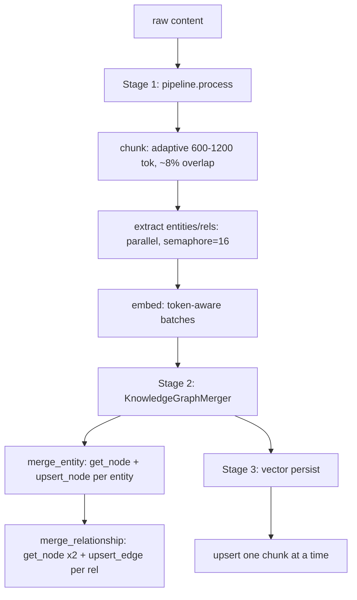

# Pipeline Flow

Source: `insert()` in
[orchestrator/ingestion.rs#L143](../../../edgequake/crates/edgequake-core/src/orchestrator/ingestion.rs#L143)

## The three stages

## Stage 1 — Process (chunk → extract → embed) ✅

- **Adaptive chunking** ([ingestion.rs#L178](../../../edgequake/crates/edgequake-core/src/orchestrator/ingestion.rs#L178)):
  chunk size 600–1200 tokens by document size, ~8% overlap. Sound.
- **Parallel extraction** ([pipeline/extraction.rs#L35](../../../edgequake/crates/edgequake-pipeline/src/pipeline/extraction.rs#L35)):
  `tokio::sync::Semaphore` bounds concurrency at `max_concurrent_extractions` (default
  16). This is the right pattern for LLM-bound work.
- **Token-aware embedding batching** ([pipeline/helpers.rs#L283](../../../edgequake/crates/edgequake-pipeline/src/pipeline/helpers.rs#L283)):
  flushes a batch when either the token budget or the input-count limit would be
  exceeded — respects provider limits. This is genuinely good engineering.

## Stage 2 — Graph merge (the slow part)

Per result, the merger loops entities then relationships
([merger/mod.rs#L130](../../../edgequake/crates/edgequake-pipeline/src/merger/mod.rs#L130)). Each entity and each
relationship is a sequential chain of graph round trips — the F2/F3 amplification.
**Deduplication** is solid: entity keys are normalized (UPPERCASE + underscores,
[merger/mod.rs#L193](../../../edgequake/crates/edgequake-pipeline/src/merger/mod.rs#L193)) so case/punctuation variants collapse,
and descriptions are merged (optionally via LLM summarization). The *logic* is right;
the *transport* is wasteful.

## Stage 3 — Vector persist

Loops chunks, calling `upsert(&[one_chunk])` each iteration
([ingestion.rs#L287](../../../edgequake/crates/edgequake-core/src/orchestrator/ingestion.rs#L287)) — F1. Also where the chunk
text is embedded into metadata — F5.

## Where the wall-clock time goes

For a dense page, model time (extraction + embedding) and DB time are both significant,
but DB time scales with entity/relationship **density** (F3) while model time scales
with **token count**. On entity-rich documents, the ~293 serialized round trips
([`004-mutations/002-roundtrip-amplification.md`](../004-mutations/002-roundtrip-amplification.md))
can rival or exceed embedding time. Fixing the back of the pipeline is therefore
high-leverage even though the front is excellent.
