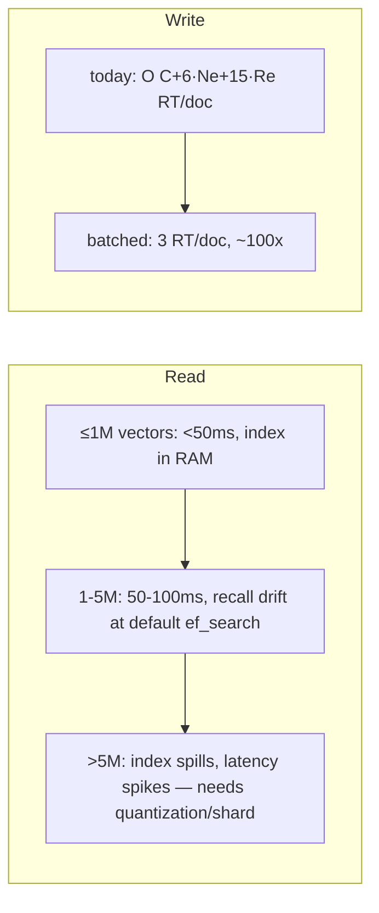

# Limits & Scaling Projections

All figures derive from the cost model
([`001-methodology/003-complexity-model.md`](../001-methodology/003-complexity-model.md))
and pgvector internals grounded in
[`zz-reference/001-pgvector`](../../../zz-reference/001-pgvector/README.md). Latency
numbers are **inferences** from HNSW `O(ef·log N)` scaling, clearly marked.

## 1. Converting documents → vectors

- Adaptive chunk size 600–1200 tokens; assume ~800 tokens/chunk effective.
- A "page" ≈ 500–700 words ≈ ~1 chunk (sometimes 2 with overlap).
- So **1 page ≈ 1–2 chunk vectors**, plus entity/relationship vectors (~10–25 per
  content-rich page).

| Corpus   | Pages   | Chunk vectors | + entity/rel vectors | Total vectors |
| -------- | ------- | ------------- | -------------------- | ------------- |
| Small KB | 1,000   | ~1.5k         | ~20k                 | ~22k          |
| Medium   | 50,000  | ~75k          | ~1M                  | ~1.1M         |
| Large    | 500,000 | ~750k         | ~10M                 | ~11M          |

> Note: entity/relationship vectors dominate the count because each page yields many.
> This makes the vector table grow **faster than page count** — a key scaling fact.

## 2. The read ceiling — RAM for the HNSW index

Per-row HNSW footprint for `vector(1536)`, `m=16`:

```
vector payload      = 4·1536 + 8           ≈ 6.15 KB
HNSW links/row      ≈ m · 2 · 4 bytes      ≈ 0.13 KB   (inference)
heap row (no text)  ≈ 6.2 KB + overhead    ≈ 6.5 KB
heap row (with F5)  ≈ 8–10 KB              (chunk text in metadata)
```

For sub-100 ms search the **HNSW index must stay resident in `shared_buffers`/OS cache**.

| Vectors | HNSW index (approx) | Heap (no F5) | Heap (with F5) | Fits in…                    |
| ------- | ------------------- | ------------ | -------------- | --------------------------- |
| 100k    | ~0.7 GB             | ~0.7 GB      | ~1 GB          | 4 GB box                    |
| 1M      | ~6.5 GB             | ~6.5 GB      | ~10 GB         | 16–32 GB box                |
| 5M      | ~32 GB              | ~32 GB       | ~50 GB         | 64 GB+ box                  |
| 11M     | ~70 GB              | ~70 GB       | ~110 GB        | needs sharding/quantization |

**Practical envelope:** a single 16–32 GB Postgres comfortably serves **~1–2 M
vectors** (≈ 50k–100k pages) with low-latency search. Beyond ~5 M vectors the index
no longer fits commodity RAM and you need: per-workspace tables (already the model!),
`halfvec`/`binary_quantize` (pgvector supports it — see `zz-reference/001-pgvector`),
or horizontal sharding.

> **F5 tax:** storing chunk text in metadata inflates heap ~50%, accelerating the point
> at which the working set spills from cache. Removing it materially raises the ceiling.

## 3. The write ceiling — round trips per document

From [`004-mutations/002-roundtrip-amplification.md`](../004-mutations/002-roundtrip-amplification.md):
a dense page ≈ **293 serialized round trips**.

| Per-RT latency   | Dense pages/sec/connection (today) | After batching (3 RT/doc) |
| ---------------- | ---------------------------------- | ------------------------- |
| 1 ms (localhost) | ~3.4 pages/s                       | ~330 pages/s              |
| 3 ms (LAN+parse) | ~1.1 pages/s                       | ~110 pages/s              |

With `max_connections = 10` ([config.rs#L81](../../../edgequake/crates/edgequake-storage/src/adapters/postgres/config.rs#L81))
and sequential `insert_batch` (F10), real concurrency is limited. **Ingestion
throughput, not storage, is the first wall most deployments hit** — and it is almost
entirely a round-trip problem (fixable per [`007-improvements/`](../007-improvements/README.md)).

## 4. How performance evolves with growth



- **Read latency** grows ~`log N` *while the index is cached*, then jumps sharply once
  the index no longer fits RAM (cache-miss cliff).
- **Recall** drifts *down* with N at fixed `ef_search=40` (F6) — invisible unless
  measured.
- **Write throughput** is flat-but-low today (round-trip bound, density-sensitive);
  batching makes it ~100× higher and density-insensitive.

## 5. Recommended capacity guardrails

| Target                     | Guardrail                                                                     |
| -------------------------- | ----------------------------------------------------------------------------- |
| Keep search < 100 ms       | keep vectors/workspace such that HNSW index ≤ 0.5 × RAM                       |
| Maintain recall as N grows | scale `ef_search` with N (F6 fix)                                             |
| Sustain ingestion          | batch writes (F1–F3) + raise `max_connections` to ≥ 2× extraction concurrency |
| Beyond 5M vectors          | adopt `halfvec`/`binary_quantize` or shard by workspace/document              |
