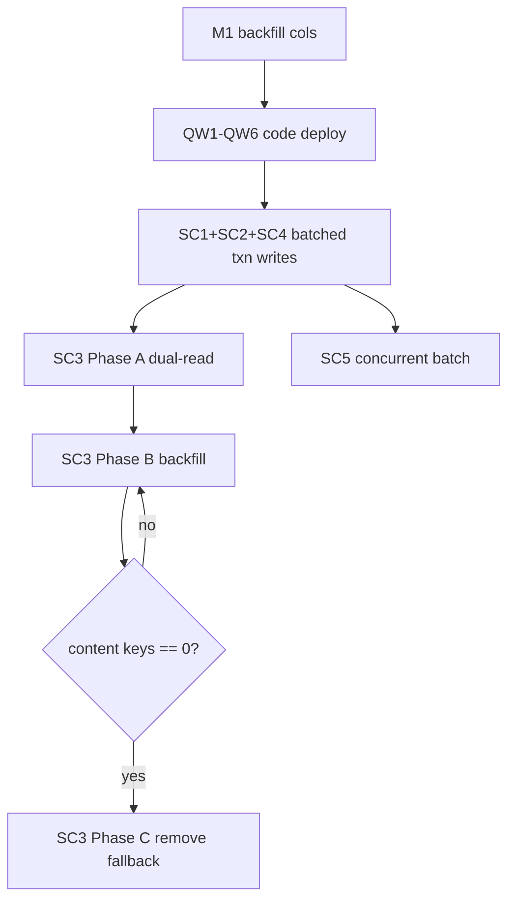

# Data Migration Plan (existing deployments)

How to ship the structural changes against live data with **zero or minimal downtime**.
Every step is idempotent and reversible. Ordered by dependency.

## Inventory of data-affecting changes

| Change                   | Schema change? | Data backfill?    | Read-path change? |
| ------------------------ | -------------- | ----------------- | ----------------- |
| QW1 session amortize     | no             | no                | no                |
| QW2 batched upsert       | no             | no                | no                |
| QW3 ef_search/iterative  | no             | no                | no                |
| SC1 batched graph writes | no             | no                | no (write only)   |
| SC2 transactions         | no             | no                | no                |
| **SC3 move chunk text**  | **yes (KV)**   | **yes**           | **yes**           |
| QW6 / workspace col      | no             | optional backfill | no                |

Only **SC3** (chunk text relocation) and the materialized-column backfill require a true
data migration. Everything else is a code deploy.

---

## Migration M1 — Backfill materialized columns (low risk, prerequisite)

Migrations 028/029 added `document_id/tenant_id/workspace_id` columns + partial indexes,
but **legacy rows written before 028 may have NULLs**. The query path already tolerates
this (column-first + JSONB-fallback), but to make QW6 and column-only filters safe:

```sql
-- Idempotent, batched to avoid a long lock. Run per eq_%_vectors table.
UPDATE eq_{prefix}_vectors
SET document_id  = COALESCE(document_id,  metadata->>'document_id', metadata->>'source_document_id'),
    tenant_id    = COALESCE(tenant_id,    metadata->>'tenant_id'),
    workspace_id = COALESCE(workspace_id, metadata->>'workspace_id')
WHERE document_id IS NULL OR tenant_id IS NULL OR workspace_id IS NULL;
```

**Edge cases:**
- **Long `UPDATE` locks the table** → batch by `ctid` ranges or `id` keyset, `LIMIT
  10000` per chunk, commit between batches.
- **Rows with no metadata keys** stay NULL → that's correct (partial index excludes
  them); keep JSONB-fallback in queries indefinitely.
- **Rollback:** harmless — re-running is a no-op (the `WHERE` excludes filled rows).

---

## Migration M2 — Relocate chunk text (SC3, the only invasive one)

**Goal:** vector `metadata` keeps a `chunk_id` pointer; chunk text lives in KV.

### Phase A — dual-read (deploy code first, no data change)

1. Deploy a read path that resolves chunk text as: **KV[chunk_id] if present, else
   `metadata->>'content'`** (legacy fallback). No data migrated yet → fully safe.
2. Deploy a write path that writes chunk text to **KV** and stores only the pointer in
   new vector rows (stops adding new inline content).

> After Phase A, new data is clean; old data still readable. The system is correct with
> a mixed corpus — this is the safety net.

### Phase B — backfill (online, batched)

For each `eq_%_vectors` row whose metadata still has `content`:

```text
for batch of rows (keyset paginated by id, 5–10k):
    write KV[row.id] = metadata->>'content'   # if not already present
    UPDATE … SET metadata = metadata - 'content'   # JSONB minus operator drops the key
```

**Edge cases:**
- **Crash mid-backfill** → idempotent: dual-read still works; re-running skips rows
  already missing `content`.
- **KV write succeeds, JSONB strip fails** → next run re-writes KV (overwrite-safe) then
  strips; no data loss.
- **GIN index churn** during mass `metadata` updates → run in off-peak batches; consider
  `SET maintenance_work_mem` higher for the session; monitor bloat and `VACUUM`.
- **Concurrent ingestion writing new rows** → new rows already have no `content`, so the
  backfill `WHERE metadata ? 'content'` naturally skips them.

### Phase C — remove legacy fallback (after backfill verified)

Once `SELECT count(*) … WHERE metadata ? 'content'` is 0 across all tables, remove the
`metadata->>'content'` fallback from the read path. Keep a feature flag to re-enable for
one release in case of stragglers.

**Reversibility:** Phases A/B are reversible (text still recoverable from KV). Phase C is
the point of no return — gate it behind verification + a release boundary.

---

## Migration M3 — HNSW rebuild for bulk-loaded corpora (optional, perf)

When importing a large existing corpus (e.g. switching to batched upsert for a bulk
load), inserting into an existing HNSW index is far slower than building the index after
load. For **bulk import only**:

```sql
DROP INDEX IF EXISTS eq_{prefix}_vectors_embedding_idx;
-- bulk COPY / batched UNNEST insert here …
SET maintenance_work_mem = '2GB';   -- session-local, speeds HNSW build
CREATE INDEX eq_{prefix}_vectors_embedding_idx
    ON eq_{prefix}_vectors USING hnsw (embedding vector_cosine_ops)
    WITH (m = 16, ef_construction = 64);
```

**Edge cases:**
- **Searches during the window** return degraded/seq-scan results while the index is
  dropped → only do this in a maintenance window or on a fresh workspace table.
- **`maintenance_work_mem` too high** can OOM the backend → size to available RAM.
- **Do NOT** drop indexes for incremental ingestion — only for one-shot bulk loads.

---

## Rollout order & gates



Each gate requires: tests green, recall benchmark not regressed, and the verification
query at zero before advancing.
