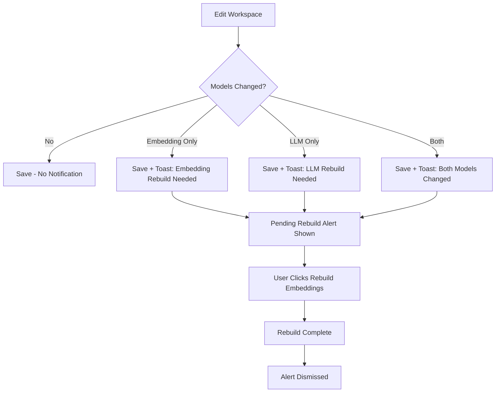

# OODA 251-255: Workspace Configuration & Rebuild Flow

**Date**: 2026-01-14
**Focus**: Workspace configuration access, hydration fix, model change rebuild notifications

## Issues Addressed

1. **Hydration Error** (Critical)
   - Error: `<p>` cannot be a descendant of `<p>` in rebuild-embeddings-button.tsx line 195
   - Cause: Radix UI's AlertDialogDescription renders as `<p>`, but contained nested `<p>` elements
   - Fix: Used `asChild` pattern with `<div>` wrapper and replaced `<p>` with `<span className="block">`

2. **Missing Workspace Configuration Link**
   - Users couldn't find workspace configuration page in navigation
   - Added `/workspace` link to sidebar with FolderKanban icon
   - Added translations for English, French, and Chinese

3. **Model Change Detection Missing**
   - Only embedding model changes were detected
   - Added `llmModelChanged` detection for LLM model changes
   - Added warning UI when LLM model changes (re-extraction required)

4. **No Rebuild Notification After Save**
   - Users weren't informed when model changes require rebuild
   - Added toast notifications after save when models change
   - Added persistent pending rebuild alert in workspace actions section

## Technical Changes

### 1. rebuild-embeddings-button.tsx
```tsx
// Before (hydration error)
<AlertDialogDescription className="space-y-2">
  <p>Description text</p>
  <p className="font-medium">Workspace name</p>
</AlertDialogDescription>

// After (fixed)
<AlertDialogDescription asChild>
  <div className="space-y-2 text-sm text-muted-foreground">
    <span className="block">Description text</span>
    <span className="block font-medium text-foreground">Workspace name</span>
  </div>
</AlertDialogDescription>
```

### 2. sidebar.tsx
```tsx
// Added new navigation item
const navItems = [
  // ... existing items
  { href: '/workspace', icon: FolderKanban, labelKey: 'nav.workspace' },
  // ... rest
];
```

### 3. workspace/page.tsx
- Added `llmModelChanged` detection alongside `embeddingModelChanged`
- Added `pendingRebuild` state to track post-save rebuild requirements
- Enhanced `updateMutation.onSuccess` to show model change notifications
- Added LLM model change warning in edit mode
- Added pending rebuild alert in workspace actions section

### 4. locales (en.json, fr.json, zh.json)
Added translations for:
- `nav.workspace` - Sidebar navigation label
- `workspace.llmChangeWarning` - LLM model change warning
- `workspace.rebuildRequired` - Model change notification title
- `workspace.rebuildPending` - Pending rebuild alert title
- And related description strings

## State Flow



## Files Modified

| File | Changes |
|------|---------|
| [rebuild-embeddings-button.tsx](edgequake_webui/src/components/workspace/rebuild-embeddings-button.tsx) | Fixed hydration error with asChild pattern |
| [sidebar.tsx](edgequake_webui/src/components/layout/sidebar.tsx) | Added workspace nav link |
| [workspace/page.tsx](edgequake_webui/src/app/(dashboard)/workspace/page.tsx) | Added model change detection and notifications |
| [en.json](edgequake_webui/src/locales/en.json) | Added workspace translations |
| [fr.json](edgequake_webui/src/locales/fr.json) | Added workspace translations |
| [zh.json](edgequake_webui/src/locales/zh.json) | Added workspace translations |

## Testing

1. **Hydration Error**
   - Verified no console errors about nested `<p>` elements
   - AlertDialog renders correctly without hydration mismatch

2. **Workspace Link**
   - Visible in sidebar navigation
   - Correctly navigates to /workspace page
   - Highlighted when active

3. **Model Change Flow**
   - Edit workspace → Change LLM model → Warning shown
   - Edit workspace → Change embedding model → Warning shown
   - Save → Toast notification appears
   - Pending rebuild alert visible in actions section

## Backend Compatibility

The rebuild functionality already exists in the backend:
- `POST /api/v1/workspaces/{id}/rebuild-embeddings` - Clears vectors
- `POST /api/v1/workspaces/{id}/reprocess-documents` - Reprocesses all documents

Both `MemoryVectorStorage` and `PgVectorStorage` implement `clear()` method.

## Next Steps (OODA 256+)

1. Consider automatic rebuild trigger after model change save
2. Add rebuild progress indicator in workspace page
3. Add estimated rebuild time based on document count
4. Consider adding extraction-only rebuild option for LLM changes
