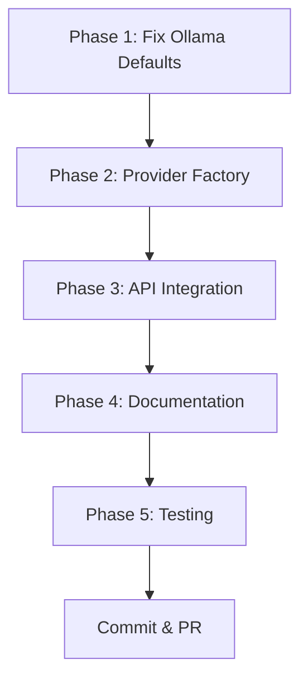

# OODA Loop Iteration #1: Decide

**Date:** 2026-01-10  
**Phase:** Implementation Planning & Decisions

## ✅ Research Findings

### Ollama Model Validation

From local Ollama instance query:

✅ **`gemma3:12b` EXISTS**

- Parameter size: 12.2B
- Family: gemma3
- Status: Available locally

✅ **`embeddinggemma:latest` EXISTS**

- Embedding dimension: **768**
- Parameter size: 307.58M
- Family: gemma3
- Context length: 2048

**Decision:** Use spec-compliant defaults!

### LM Studio Research

**Finding:** LM Studio provides OpenAI-compatible API at `http://localhost:1234/v1`

**Decision:** DO NOT create separate `LMStudioProvider` struct. Instead:

- Use `OpenAIProvider::compatible()` method
- Document LM Studio as OpenAI-compatible mode
- Add convenience factory method

## 📋 Implementation Plan

### Phase 1: Fix Ollama Defaults ⚡ (30 min)

**File:** `edgequake/crates/edgequake-llm/src/providers/ollama.rs`

**Changes:**

```rust
// Line 48-50 (current)
const DEFAULT_OLLAMA_MODEL: &str = "llama3";
const DEFAULT_OLLAMA_EMBEDDING_MODEL: &str = "nomic-embed-text";

// Change to:
const DEFAULT_OLLAMA_MODEL: &str = "gemma3:12b";
const DEFAULT_OLLAMA_EMBEDDING_MODEL: &str = "embeddinggemma:latest";

// Line 83 (current)
embedding_dimension: 768, // nomic-embed-text default

// Change to:
embedding_dimension: 768, // embeddinggemma:latest default (VERIFIED)
```

**Testing:**

- Unit test: Verify builder creates provider with new defaults
- Document dimension matches embeddinggemma

**Commit Message:**

```
feat(llm): Update Ollama defaults to gemma3 models per spec

- Change DEFAULT_OLLAMA_MODEL: llama3 -> gemma3:12b
- Change DEFAULT_OLLAMA_EMBEDDING_MODEL: nomic-embed-text -> embeddinggemma:latest
- Verify embedding_dimension=768 for embeddinggemma (confirmed via API)

Ref: specs/032-ollama-lmstudio-provider
OODA Loop #1 - Act Phase 1
```

---

### Phase 2: Provider Factory 🏭 (2 hours)

**New File:** `edgequake/crates/edgequake-llm/src/factory.rs`

```rust
//! LLM provider factory for environment-based selection.
//!
//! @implements SPEC-032: Ollama/LM Studio provider support
//! @implements FEAT0017: Multi-provider LLM support
//!
//! # Environment Variables
//!
//! - `EDGEQUAKE_LLM_PROVIDER`: Override provider selection (openai|ollama|lmstudio|mock)
//! - Provider-specific vars: See individual provider docs

use std::sync::Arc;
use crate::error::Result;
use crate::traits::{LLMProvider, EmbeddingProvider};
use crate::providers::{OpenAIProvider, OllamaProvider, MockProvider};

/// Supported provider types
#[derive(Debug, Clone, Copy, PartialEq, Eq)]
pub enum ProviderType {
    OpenAI,
    Ollama,
    LMStudio,
    Mock,
}

impl ProviderType {
    /// Parse from string (case-insensitive)
    pub fn from_str(s: &str) -> Option<Self> {
        match s.to_lowercase().as_str() {
            "openai" => Some(Self::OpenAI),
            "ollama" => Some(Self::Ollama),
            "lmstudio" | "lm-studio" | "lm_studio" => Some(Self::LMStudio),
            "mock" => Some(Self::Mock),
            _ => None,
        }
    }
}

/// Provider factory for creating LLM and embedding providers.
pub struct ProviderFactory;

impl ProviderFactory {
    /// Auto-detect and create providers from environment.
    ///
    /// Priority:
    /// 1. `EDGEQUAKE_LLM_PROVIDER` environment variable
    /// 2. Auto-detect: OLLAMA_HOST -> OPENAI_API_KEY -> Mock
    pub fn from_env() -> Result<(Arc<dyn LLMProvider>, Arc<dyn EmbeddingProvider>)> {
        // Check explicit provider selection
        if let Ok(provider_str) = std::env::var("EDGEQUAKE_LLM_PROVIDER") {
            if let Some(provider_type) = ProviderType::from_str(&provider_str) {
                return Self::create(provider_type);
            }
        }

        // Auto-detect based on environment
        if std::env::var("OLLAMA_HOST").is_ok()
            || std::env::var("OLLAMA_MODEL").is_ok() {
            return Self::create(ProviderType::Ollama);
        }

        if let Ok(api_key) = std::env::var("OPENAI_API_KEY") {
            if !api_key.is_empty() && api_key != "test-key" {
                return Self::create(ProviderType::OpenAI);
            }
        }

        // Fallback to mock
        Ok(Self::create_mock())
    }

    /// Create specific provider type
    pub fn create(provider_type: ProviderType) -> Result<(
        Arc<dyn LLMProvider>,
        Arc<dyn EmbeddingProvider>
    )> {
        match provider_type {
            ProviderType::OpenAI => Self::create_openai(),
            ProviderType::Ollama => Self::create_ollama(),
            ProviderType::LMStudio => Self::create_lmstudio(),
            ProviderType::Mock => Ok(Self::create_mock()),
        }
    }

    /// Create OpenAI provider from OPENAI_API_KEY
    fn create_openai() -> Result<(Arc<dyn LLMProvider>, Arc<dyn EmbeddingProvider>)> {
        let api_key = std::env::var("OPENAI_API_KEY")
            .map_err(|_| crate::error::LlmError::ConfigError(
                "OPENAI_API_KEY not set".to_string()
            ))?;

        let provider = Arc::new(OpenAIProvider::new(api_key));
        Ok((provider.clone(), provider))
    }

    /// Create Ollama provider from environment
    fn create_ollama() -> Result<(Arc<dyn LLMProvider>, Arc<dyn EmbeddingProvider>)> {
        let provider = Arc::new(OllamaProvider::from_env()?);
        Ok((provider.clone(), provider))
    }

    /// Create LM Studio provider (OpenAI-compatible)
    fn create_lmstudio() -> Result<(Arc<dyn LLMProvider>, Arc<dyn EmbeddingProvider>)> {
        let host = std::env::var("LMSTUDIO_HOST")
            .unwrap_or_else(|_| "http://localhost:1234".to_string());

        let model = std::env::var("LMSTUDIO_MODEL")
            .unwrap_or_else(|_| "gemma2-9b-it".to_string());

        let embedding_model = std::env::var("LMSTUDIO_EMBEDDING_MODEL")
            .unwrap_or_else(|_| "text-embedding-ada-002".to_string());

        let provider = Arc::new(
            OpenAIProvider::compatible("lmstudio-key", format!("{}/v1", host))
                .with_model(model)
                .with_embedding_model(embedding_model)
        );

        Ok((provider.clone(), provider))
    }

    /// Create mock provider for testing
    fn create_mock() -> (Arc<dyn LLMProvider>, Arc<dyn EmbeddingProvider>) {
        let provider = Arc::new(MockProvider::new());
        (provider.clone(), provider)
    }

    /// Get embedding dimension for current provider
    pub fn embedding_dimension() -> Result<usize> {
        let (_, embedding_provider) = Self::from_env()?;
        Ok(embedding_provider.dimension())
    }
}

#[cfg(test)]
mod tests {
    use super::*;

    #[test]
    fn test_provider_type_parsing() {
        assert_eq!(ProviderType::from_str("openai"), Some(ProviderType::OpenAI));
        assert_eq!(ProviderType::from_str("OLLAMA"), Some(ProviderType::Ollama));
        assert_eq!(ProviderType::from_str("lmstudio"), Some(ProviderType::LMStudio));
        assert_eq!(ProviderType::from_str("lm-studio"), Some(ProviderType::LMStudio));
        assert_eq!(ProviderType::from_str("mock"), Some(ProviderType::Mock));
        assert_eq!(ProviderType::from_str("invalid"), None);
    }

    #[test]
    fn test_mock_creation() {
        let (llm, embedding) = ProviderFactory::create_mock();
        assert_eq!(llm.name(), "mock");
        assert_eq!(embedding.dimension(), 1536);
    }
}
```

**Export in `lib.rs`:**

```rust
pub mod factory;
pub use factory::{ProviderFactory, ProviderType};
```

**Testing:**

- Unit tests for provider type parsing
- Unit tests for mock creation
- Integration test with env vars

**Commit Message:**

```
feat(llm): Add ProviderFactory for env-based provider selection

- New factory.rs module with ProviderFactory
- Auto-detect provider: OLLAMA_HOST > OPENAI_API_KEY > Mock
- Support EDGEQUAKE_LLM_PROVIDER override
- LM Studio via OpenAI-compatible mode
- Full test coverage

Ref: specs/032-ollama-lmstudio-provider
OODA Loop #1 - Act Phase 2
```

---

### Phase 3: API Integration 🔌 (1 hour)

**File:** `edgequake/crates/edgequake-api/src/state.rs`

**Changes:**

```rust
// Line 315 (current)
pub fn new_memory(llm_api_key: impl Into<String>) -> Self {
    let llm_provider = Arc::new(OpenAIProvider::new(llm_api_key));

// Replace with:
pub fn new_memory(llm_api_key: Option<impl Into<String>>) -> Self {
    use edgequake_llm::ProviderFactory;

    // If API key provided, use it; otherwise use env-based selection
    let (llm_provider, embedding_provider) = if let Some(key) = llm_api_key {
        std::env::set_var("OPENAI_API_KEY", key.into());
        ProviderFactory::from_env()
            .expect("Failed to create LLM provider")
    } else {
        ProviderFactory::from_env()
            .expect("Failed to create LLM provider")
    };

    // Get embedding dimension from provider
    let embedding_dim = embedding_provider.dimension();
    let vector_storage = Arc::new(MemoryVectorStorage::new("default", embedding_dim));

    // ... rest of initialization using llm_provider and embedding_provider
}
```

**Similar changes for:**

- `new_with_postgres()` method
- Other state constructors

**Testing:**

- API server starts with `EDGEQUAKE_LLM_PROVIDER=ollama`
- API server starts with `OPENAI_API_KEY=...`
- Vector dimension matches provider

**Commit Message:**

```
feat(api): Use ProviderFactory for env-based provider selection

- Replace hardcoded OpenAIProvider with ProviderFactory
- Auto-configure vector dimension from embedding provider
- Support all provider types via environment
- Backward compatible with explicit API key

Ref: specs/032-ollama-lmstudio-provider
OODA Loop #1 - Act Phase 3
```

---

### Phase 4: Documentation 📚 (1 hour)

**Update Files:**

1. **`docs/0007-configuration-reference.md`**

   - Add `EDGEQUAKE_LLM_PROVIDER` variable
   - Document LM Studio configuration
   - Update Ollama defaults

2. **`docs/0005-llm-integration.md`**

   - Add provider switching section
   - LM Studio setup guide
   - Embedding dimension table

3. **README.md** (if exists)
   - Quick start with different providers

**Commit Message:**

```
docs: Update LLM provider configuration docs

- Document EDGEQUAKE_LLM_PROVIDER variable
- Add LM Studio configuration guide
- Update Ollama defaults (gemma3:12b)
- Add embedding dimension reference table

Ref: specs/032-ollama-lmstudio-provider
OODA Loop #1 - Act Phase 4
```

---

### Phase 5: Testing 🧪 (2 hours)

**New Test File:** `edgequake/crates/edgequake-llm/tests/e2e_provider_factory.rs`

```rust
//! End-to-end tests for ProviderFactory

use edgequake_llm::{ProviderFactory, ProviderType, LLMProvider, EmbeddingProvider};
use std::env;

#[test]
fn test_factory_with_env_var() {
    env::set_var("EDGEQUAKE_LLM_PROVIDER", "mock");
    let (llm, embedding) = ProviderFactory::from_env().unwrap();
    assert_eq!(llm.name(), "mock");
}

#[test]
fn test_factory_openai_auto_detect() {
    env::set_var("OPENAI_API_KEY", "sk-test");
    env::remove_var("EDGEQUAKE_LLM_PROVIDER");
    let (llm, _) = ProviderFactory::from_env().unwrap();
    assert_eq!(llm.name(), "openai");
}

#[test]
fn test_factory_ollama_auto_detect() {
    env::set_var("OLLAMA_HOST", "http://localhost:11434");
    env::remove_var("OPENAI_API_KEY");
    let (llm, _) = ProviderFactory::from_env().unwrap();
    assert_eq!(llm.name(), "ollama");
}

#[test]
fn test_embedding_dimension_detection() {
    env::set_var("EDGEQUAKE_LLM_PROVIDER", "ollama");
    let dim = ProviderFactory::embedding_dimension().unwrap();
    assert_eq!(dim, 768); // embeddinggemma
}
```

**Existing Tests to Update:**

- `edgequake/crates/edgequake-api/tests/*` - Use factory instead of hardcoded providers

**Commit Message:**

```
test(llm): Add comprehensive ProviderFactory tests

- E2E tests for env-based provider selection
- Auto-detection priority tests
- Embedding dimension detection tests
- Update API tests to use factory

Ref: specs/032-ollama-lmstudio-provider
OODA Loop #1 - Act Phase 5
```

---

## ⚠️ Deferred: Vector Migration Utility

**Decision:** DEFER to Iteration #2

**Rationale:**

- Core provider switching is more urgent
- Migration utility is complex (requires document re-embedding)
- Can be separate feature with CLI tool
- Need to coordinate with storage team

**Plan for Iteration #2:**

1. Design migration API
2. Implement dimension detection
3. Add CLI command
4. Test with real data

---

## 📊 Execution Order



**Total Estimated Time:** 6.5 hours

---

## ✅ Success Criteria (Checklist)

- [ ] Ollama provider uses gemma3:12b and embeddinggemma:latest
- [ ] ProviderFactory auto-detects providers from environment
- [ ] LM Studio works via `EDGEQUAKE_LLM_PROVIDER=lmstudio`
- [ ] API server respects provider environment variables
- [ ] Vector dimension auto-configured (768 for Ollama, 1536 for OpenAI)
- [ ] All tests pass (Mock, OpenAI, Ollama)
- [ ] Documentation updated with examples
- [ ] No breaking changes to existing API

---

## 🔜 Next: Act Phase

Ready to implement!

**Start with:** Phase 1 (Ollama defaults) - Quick win to build momentum!
