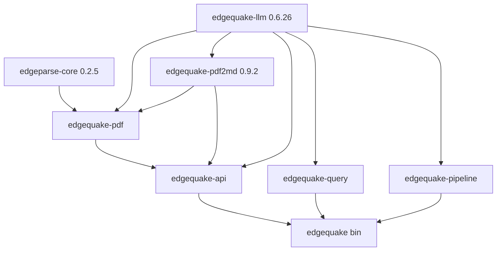

# SPEC-036 — Dependency DAG & Version Matrix

---

## Dependency graph



**Publish / verify order:** `edgeparse-core` ∥ `edgequake-llm` → `edgequake-pdf2md` (optional) → `edgequake`.

`edgeparse-core` and `edgequake-llm` are **independent** — can proceed in parallel.

---

## Version matrix

| Crate | GitHub repo | crates.io | EdgeQuake needs | Action |
|-------|-------------|-----------|-----------------|--------|
| `edgeparse-core` | raphaelmansuy/edgeparse | **0.2.5** ✅ | ≥ 0.2.0 API | Verify only |
| `pdf-cos` (transitive) | same | 0.39.0 ✅ | transitive | — |
| `edgequake-llm` | raphaelmansuy/edgequake-llm | 0.6.25 ❌ need **0.6.26** | **0.6.26** API | **Publish** |
| `edgequake-pdf2md` | raphaelmansuy/edgequake-pdf2md | **0.9.2** ✅ | ≥ 0.7.0 API | Use registry |
| `pdfium-auto` (transitive) | same | 0.3 ✅ | bundled feature | — |

---

## EdgeQuake feature → crate mapping

| EdgeQuake feature | Crates | Feature flags |
|-------------------|--------|---------------|
| Vision PDF upload | `edgequake-pdf2md`, `edgequake-llm` | `vision`, `bundled` |
| EdgeParse PDF backend | `edgeparse-core` | default |
| Cross-encoder rerank | `edgequake-llm` | default + factory |
| Entity extraction | `edgequake-llm` | via pipeline |
| Multimodal chat | `edgequake-llm` | vision traits |

---

## Publish gate checklist (per crate)

### edgequake-llm@0.6.26

| Gate | Command / check |
|------|-----------------|
| PR merged to `main` | GitHub PR #79 |
| Version bump | `Cargo.toml` = `0.6.26` ✅ |
| CHANGELOG | `[0.6.26]` section ✅ |
| README | Update badge if auto-generated; verify reranker docs link |
| CI green | `cargo fmt`, `clippy -D warnings`, `test --locked`, `doc` |
| Security | `cargo audit` |
| Tag | `git tag v0.6.26 && git push origin v0.6.26` |
| Publish | CI `publish.yml` or manual `cargo publish --locked` |
| Verify | `cargo search edgequake-llm --limit 1` shows 0.6.26 |

### edgequake-pdf2md@0.9.2 (existing) or @0.9.3 (optional)

| Gate | 0.9.2 (reuse) | 0.9.3 (optional) |
|------|---------------|------------------|
| Functional delta | none | bump `edgequake-llm` dep to `0.6.26` |
| Already on crates.io | ✅ | needs tag + publish |
| EdgeQuake compatible | ✅ | ✅ |

### edgeparse-core@0.2.5

| Gate | Status |
|------|--------|
| On crates.io | ✅ |
| EdgeQuake API compatible | ✅ |
| New release needed | ❌ |

---

## Target EdgeQuake `Cargo.toml` (post-migration)

```toml
[workspace.dependencies]
edgequake-llm = "0.6.26"
edgeparse-core = "0.2.5"
edgequake-pdf2md = { version = "0.9.2", default-features = false, features = ["bundled"] }

# DELETE entire [patch.crates-io] section for these crates
```

Optional pdf2md bump:

```toml
edgequake-pdf2md = { version = "0.9.3", default-features = false, features = ["bundled"] }
```

---

## crates.io index latency

| Workflow | Wait after dep publish |
|----------|------------------------|
| edgequake-llm publish → pdf2md publish | 45 s (pdf2md CI) |
| pdf-cos → edgeparse-core | 30 s (edgeparse CI) |
| Any publish → EdgeQuake `cargo update` | 60–120 s (poll `cargo search`) |
