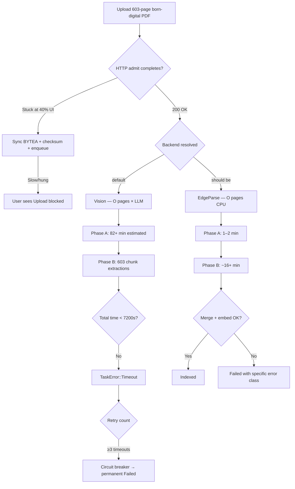

# SPEC-038 — 5 WHYs: Root Cause Analysis of Large PDF Ingestion Failure

**Lens:** Root Cause Analysis  
**Method:** 5 WHYs — iterative causal chain to structural root  
**Evidence:** Reproducer PDF measured 2026-07-01; code verified against live sources  
**Reproducer:** `guide_2606.24937v1-opt.pdf` — 603 pages, 11 MB, 1.44 MB born-digital text

---

## The Symptom

A user uploads *The Hitchhiker's Guide to Agentic AI* (arXiv `2606.24937v1`, 603 pages) to EdgeQuake.  
The document appears in the UI, shows **Processing** / **Converting**, then transitions to **Failed**.  
No queryable knowledge is produced. Retry may trip the **circuit breaker** after repeated timeouts.

---

## Symptom A — Vision Path Timeout on Born-Digital PDF

### WHY 1 — Why does ingestion fail for this PDF?

**Because the end-to-end task exceeds the worker processing timeout (7200 s) or the vision outer timeout, and the task is marked permanently failed.**

```rust
// edgequake/crates/edgequake-tasks/src/worker.rs:182
processing_timeout_secs: 7200.max(MIN_PROCESSING_TIMEOUT_SECS),
```

For 603 pages with cloud vision (Mistral `pixtral-large-latest` observed in logs):

```rust
// edgequake/crates/edgequake-api/src/safety_limits.rs:641–644
// vision_outer_timeout_secs: 120 + (603 × 8) = 4944 s ≈ 82 min (Phase A alone)
```

Phase B (603 chunk extractions) adds **≥15–40 min**. Graph merge adds variable DB time.  
**Total often exceeds 7200 s** when Vision is used.

### WHY 2 — Why is Vision used for a text-native PDF?

**Because `PdfParserBackend::Vision` is the enum default and upload options default `enable_vision: true`.**

```rust
// edgequake/crates/edgequake-pdf/src/backend/mod.rs:17–20
pub enum PdfParserBackend {
    #[default]
    Vision,
    EdgeParse,
}
```

```rust
// edgequake/crates/edgequake-api/src/handlers/pdf_upload/types.rs:14–15
/// Enable vision LLM processing (default: true).
pub enable_vision: bool,
```

There is **no text-layer probe** at admission time. A PDF with 1.44 MB of extractable text (verified via `pdftotext`) is treated identically to a 603-page scan.

### WHY 3 — Why doesn't the system detect born-digital text before invoking Vision?

**Because backend resolution stops at workspace/env/form override — no content inspection step exists.**

```rust
// edgequake/crates/edgequake-api/src/handlers/pdf_upload/types.rs:67–72
pub fn resolved_backend(&self, workspace: Option<&Workspace>) -> PdfParserBackend {
    self.pdf_parser_backend
        .or_else(|| workspace.and_then(|ws| ws.pdf_parser_backend))
        .or_else(PdfParserBackend::from_env)
        .unwrap_or_default()  // ← Vision
}
```

`extract_page_count` runs at upload (`upload.rs:590`) but **text density / layer presence is not measured**.

### WHY 4 — Why wasn't EdgeParse the obvious fallback for this upload?

**EdgeParse fallback only triggers after Vision fails or times out** — wasting the first failure cycle.

```rust
// edgequake/crates/edgequake-api/src/processor/pdf_processing.rs:730–747
Err(_elapsed) => {
    // Vision extraction timed out; falling back to EdgeParse
```

For 603 pages, the first Vision attempt may consume **>60 min** before fallback even starts.  
The worker may already be dead at 7200 s.

### WHY 5 — Why is the architecture wrong at the root?

**Because PDF ingestion conflates two problems with different complexity classes:**

| Problem | Correct tool | Complexity |
| ------- | ------------ | ---------- |
| Extract text from born-digital PDF | EdgeParse (pdfium) | **O(pages)** CPU |
| OCR scanned / figure-heavy PDF | Vision LLM | **O(pages × LLM_latency)** |

Defaulting to Vision makes every PDF pay the **expensive asymptotic class**.  
The system lacks a **routing function** at the admission boundary.

---

## Symptom B — Fixed Worker Timeout vs Document Scale

### WHY 1 — Why does a 603-page task hit the worker wall even if Vision completes?

**Because `TASK_PROCESSING_TIMEOUT_SECS` defaults to 7200 s regardless of page count.**

The worker comment contradicts the constant:

```rust
// worker.rs:154–156 — comment says 1000+ pages ≈ 3.3 h
// worker.rs:182 — code sets 2 h
```

603 × 12 s/page (comment assumption) = 7236 s for Phase A alone — **already over cap**.

### WHY 2 — Why isn't timeout derived from document profile?

**Because timeout is configured once in `WorkerPoolConfig::default()` with only an env override — no per-task input.**

There is no `LargeDocumentProfile` passed from `PdfProcessingData` to the worker timeout wrapper.

### WHY 3 — Why do retries make it worse?

**Circuit breaker trips after 3 consecutive `TaskError::Timeout`:**

```rust
// edgequake-tasks/src/types/task.rs:206+
fn check_circuit_breaker(&mut self) { ... }
```

Each retry may **restart Vision** (unless markdown checkpoint exists), multiplying cost.

### WHY 4 — Why doesn't resume always save the day?

**Resume shortcut requires non-empty `markdown_content` in `pdf_documents`:**

```rust
// pdf_processing.rs:368–375
if let Some(stored_markdown) = pdf.markdown_content.clone() {
    if !stored_markdown.is_empty() {
        // RESUME: skip PDF conversion
```

If timeout occurs **during** Phase A before markdown is persisted, resume **re-runs Vision**.

### WHY 5 — Structural gap?

**No single SSOT connects: pages × backend × provider → timeout budget + user ETA + retry policy.**

---

## Symptom C — Post-Conversion Bottlenecks (Secondary)

Even with EdgeParse, 603 pages may fail later:

### WHY 1 — Entity extraction is O(chunks) LLM calls

603 chunks × semaphore 16 × up to 180 s timeout/chunk → **worst case hours**.

### WHY 2 — Graph merge is O(entities + relationships) sequential DB round-trips

Documented in SPEC-016: each entity is `get_node + upsert_node`.  
A 603-page AI survey may yield **thousands of entities**.

### WHY 3 — Embedding "too many inputs" (SPEC-011 EC-001)

Dense entity lists can exceed provider input-count limits → **permanent 400**, retried 3×.

### WHY 4 — `MAX_DOCUMENT_SIZE_BYTES = 10MB` in orchestrator

This PDF's markdown is 1.44 MB — **safe today**.  
A 603-page legal scan via Vision OCR could exceed 10 MB and fail **after** expensive conversion.

### WHY 5 — Limits are inconsistent across layers

| Layer | Limit |
| ----- | ----- |
| Upload | 50 MB (`MAX_UPLOAD_BYTES`) |
| Orchestrator insert | 10 MB (`ingestion.rs:138`) |
| Injection handler | 10 MB (`injection_file.rs:41`) |

---

## Symptom D — Upload Appears Stuck at "Step 2" (Observed 2026-07-01)

**User report:** `guide_2606.24937v1-opt.pdf` (10 784 KB shown in UI) sits at **"Step 2: Uploading to server…"** with progress bar ~40% and **0/1 files complete**. Converting has **not** started.

### WHY 1 — Why does the UI show "Uploading" for a long time?

**Because the frontend maps the entire HTTP round-trip to a single phase with a fixed 40% progress value.**

```typescript
// use-file-upload.ts — progress is NOT tied to bytes on the wire
status: "uploading", progress: 40,
phase: t("documents.upload.uploading") // locales/en.json: "Step 2: Uploading to server..."
```

The UI advances only when `uploadPdfDocument()` → `apiClient()` → `fetch()` **resolves**. Until then, the user sees a **frozen** step-2 indicator.

### WHY 2 — Why doesn't the HTTP request return quickly?

**Because the upload handler performs heavyweight **synchronous admit work** before sending `200 OK`:**

```rust
// upload.rs — all blocking inside one request
validate_pdf_data(&file_data)?;
let checksum = calculate_pdf_checksum(&file_data);           // O(11 MB)
pdf_storage.create_pdf(CreatePdfRequest { pdf_data: file_data.clone(), ... })  // O(11 MB) INSERT
create_pdf_processing_task(...).await?;
```

No early `202 Accepted`. The client waits for **full BYTEA persist** to PostgreSQL.

### WHY 3 — Why is 11 MB slow enough to notice?

**Because admit cost scales with bytes, not pages, and is on the critical path:**

| Cost | 11 MB reproducer |
| ---- | ---------------- |
| Multipart read into `Vec<u8>` | 11 MB RAM |
| `file_data.clone()` for INSERT | +11 MB RAM |
| SHA-256 | ~100–500 ms |
| PostgreSQL BYTEA write | 1–30+ s under load |
| Dev proxy (`next.config.ts` rewrite → backend) | buffers full body |

**Truth:** This is **not** EdgeParse vs Vision. Conversion starts **after** the upload response.

### WHY 4 — Why is there no client-side timeout or byte progress?

**Because `apiClient` uses bare `fetch()` with no `AbortSignal.timeout` and no `XMLHttpRequest.upload.onprogress`.**

```typescript
// client.ts — BR0701 documents 30 s timeout but fetch has no enforced deadline
const response = await fetch(url, config);
```

A stalled backend or proxy can leave the UI at 40% **indefinitely**.

### WHY 5 — Structural gap?

**Upload UX assumes admit is instant. For multi‑MB PDFs, admit is O(bytes) and synchronous — violating the user's mental model of "upload then process".**

**Fix direction (REQ-038-11):** Fast ack + async persist **or** honest transfer progress + admit sub-status + size-scaled client timeout.

---

## Root Cause Summary

```text
┌────────────────────────────────────────────────────────────────────┐
│  STRUCTURAL ROOT: Wrong default complexity class for born-digital  │
│  PDFs + fixed worker timeout decoupled from document scale         │
├────────────────────────────────────────────────────────────────────┤
│  RC-038-01  Vision default on text-native PDFs                     │
│  RC-038-02  Worker timeout 7200 s < required for N>500 vision     │
│  RC-038-03  Fallback only after expensive Vision failure           │
│  RC-038-04  No admission-time text probe / ETA                     │
│  RC-038-05  Post-extraction O(chunks) + O(entities) unbounded     │
│  RC-038-06  Inconsistent 10 MB vs 50 MB content limits           │
│  RC-038-07  Sync admit (BYTEA+checksum) blocks HTTP; UI fake 40%  │
└────────────────────────────────────────────────────────────────────┘
```

---

## Causal Chain (Mermaid)


