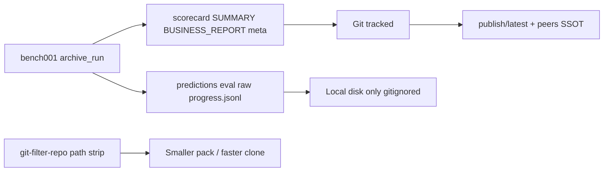

# SPEC-097 — Git History Hygiene (GH-351)

> **Product pin**: EdgeQuake v0.22.0+  
> **Status**: Waves 0–4 — strip regenerable bench001 fat from tip + history  
> **GitHub**: [#351](https://github.com/raphaelmansuy/edgequake/issues/351)  
> **Inherits**: [SPEC-001 benchmark](../001-benchmark/) · [CONTRIBUTING.md](../../CONTRIBUTING.md)  
> **Peers**: [git-filter-repo](https://github.com/newren/git-filter-repo) · [GitHub large files](https://docs.github.com/en/repositories/working-with-files/managing-large-files/about-large-files-on-github)

## Start here

1. [00-why.md](00-why.md) — Five WHYs + causal ASCII  
2. [00-first-principles.md](00-first-principles.md) — LAW-G1…G6  
3. [01-finding-register.md](01-finding-register.md) — F-351-*  
4. [02-cross-ref-matrix.md](02-cross-ref-matrix.md) — code ↔ law ↔ guard  
5. [03-implementation-roadmap.md](03-implementation-roadmap.md) — Waves 0–4 + DoD  
6. [04-e2e-test-matrix.md](04-e2e-test-matrix.md) — gates G1–G5  
7. [05-edge-cases.md](05-edge-cases.md) — EC register  
8. Issue study → [`issues/GH-351-benchmark-history-disk.md`](issues/GH-351-benchmark-history-disk.md)  
9. Rewrite runbook → [`runbook/history-rewrite.md`](runbook/history-rewrite.md)  
10. Lenses → [`lenses/`](lenses/README.md)

## Locked decisions

1. **Git stores source + thin SSOT** — never regenerable bulk run outputs (LAW-G1).  
2. **Acc / latency claims** live in `publish/latest`, `publish/peers/*`, and thin per-run `scorecard.json` + human reports (LAW-G2).  
3. **Fat local-only**: `predictions_*.json`, `eval_*.json`, `eval_*.raw.json`, `logs/progress.jsonl` (LAW-G3).  
4. **History rewrite required** — tip delete alone does not shrink clones (LAW-G4).  
5. **Prevention**: expanded `.gitignore` + `make git-hygiene` (LAW-G5).  
6. **No Git LFS** for these experiment scratch files (LAW-G6).  
7. Keep **thin** `history/<run>/` in git (preserves SPEC-001 doc links).

## Surfaces

| Surface | Role |
|---------|------|
| `.gitignore` | Block fat globs from re-entry |
| `tools/bench001/.../progress.py` `archive_run` | Still write fat locally; emit `LOCAL_ONLY.md` |
| `tools/git-hygiene/check_no_fat_artifacts.sh` | CI / make guard |
| `specs/001-benchmark/e2e/artifacts/history/` | Thin archives only in VCS |
| `specs/001-benchmark/e2e/artifacts/publish/` | Acc SSOT (unchanged) |
| `git filter-repo` runbook | One-shot pack reclaim |

## Data flow



## Verification

```bash
make git-hygiene
git ls-files 'specs/001-benchmark/e2e/artifacts/**/predictions_*.json' | wc -l   # expect 0
git ls-files 'specs/001-benchmark/e2e/artifacts/**/eval_*.json' | wc -l          # expect 0
```

See [04-e2e-test-matrix.md](04-e2e-test-matrix.md) for full gates. After Wave 2 rewrite, re-measure pack with `git count-objects -vH`.

## Lens index

| Lens | Primary question |
|------|------------------|
| [Product Owner](lenses/LENS-product-owner.md) | What is done for clone pain / #351? |
| [DevOps / Git](lenses/LENS-devops-git.md) | Rewrite + force-push + re-clone |
| [Benchmark tooling](lenses/LENS-benchmark-tooling.md) | archive_run + local-only fat |
