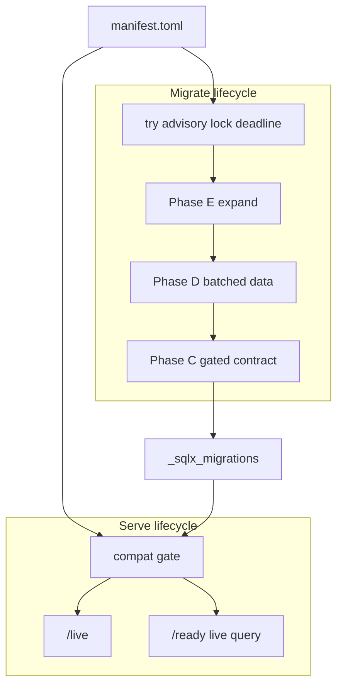

# 06 — Target architecture

Parent: [README](README.md) · Laws: [01](01-first-principles.md) · Defects: [05](05-root-cause-analysis.md) · Implement: [08](08-implementation-plan.md)

## Picture

```text
                    migrations/manifest.toml  (SSOT)
                    + numbered *.sql + support/ (locked)
                              |
          +-------------------+-------------------+
          |                                       |
          v                                       v
   edgequake migrate                         edgequake (serve)
   [runner]                                  [compat gate]
          |                                       |
          |  Phase E expand                       |  applied in [min,max] window?
          |  Phase D data jobs                    |     yes -> bind, /ready 200
          |  Phase C contract (gated)             |     wait -> bind, /live 200,
          |                                       |            /ready 503 poll
          v                                       |     fail -> exit 78 (opt-in)
   _sqlx_migrations
   edgequake.migration_run  (telemetry)
```



## Manifest (WP-1)

New file `edgequake/migrations/manifest.toml`, compiled into the migrator (build.rs or `include_str!` + toml). Example shape (normative fields; values illustrative):

```toml
schema_version = 1
compat_serve_min = 149          # oldest ledger max this binary will wait/serve
compat_serve_max = 158          # newest ledger max this binary understands
irreversible_drop = [125, 126, 131]
legacy_cutover_assert = 142

[[migration]]
version = 1
file = "001_init_database.sql"
phase = "expand"
checksums = [
  "bb40c61f7d5cbeafa7827f2e…",   # current / most tags
  "9e44513e1b22ab482a3703f3…",   # v0.11.0 only
]

[[migration]]
version = 128
file = "128_spec091_listing_indexes.sql"
phase = "expand"
no_transaction = false
lock_class = "ddl_share"         # SHARE index build
# authoring lint forbids inner BEGIN/COMMIT going forward

[[migration]]
version = 156
phase = "data"
no_transaction = true            # batch commits allowed
lock_class = "dml_batch"

[[migration]]
version = 125
phase = "contract"
confirm_drop = true
```

`checksums.lock` remains the CI pin of **the first (current) hash per file**. Manifest holds **history**. `update_migration_checksums.sh` becomes **append-only** for existing versions (WP-6).

## Runner (WP-3)

Same subcommand `edgequake migrate` (see alternatives below). Algorithm:

```text
  1. Connect admin role. SET statement_timeout, lock_timeout (class defaults).
  2. LOOP: pg_try_advisory_lock(run_key) OR sleep/retry until deadline
          ELSE exit 75 EX_TEMPFAIL
  3. INSERT migration_run (id, binary_version, started_at)
  4. Auto-rewrite checksum ONLY if stored in manifest.checksums[version]
     Unknown mismatch -> fail closed (message includes fossil hashes + LAW)
  5. If Dirty(success=false): print version, SQLSTATE, recovery (11-ops)
  6. Apply pending in phase order:
       E: sqlx (filtered) with lock_timeout retry on 55P03
       D: data engine / no_tx batched scripts; cursor must not skip failures
       C: require --confirm-drop; refuse if coverage RED
  7. Record per-version duration_ms into migration_run_step
  8. Unlock. exit 0
```

CLI verbs stay: `dry-run`, `status`, `plan`, `guard`. `status` reads live ledger + last run row (not a boot snapshot).

## Serving gate (WP-5)

`EDGEQUAKE_SCHEMA_GATE=wait|fail` (default **wait** in Helm/compose values, **fail** acceptable for `make backend` if migrate already ran).

```text
  embedded_max = max(manifest.versions)
  applied_max  = max(_sqlx_migrations.version where success)

  if applied_max in [compat_serve_min, compat_serve_max]
       AND no pending Phase E required by this binary:
     ready
  else if gate=wait AND applied_max <= embedded_max:
     bind; ready=false reason=schema_pending
     background poll 2s; flip ready without restart
  else if applied_max > compat_serve_max:
     refuse NEWER (still exit 78) -- cannot serve schema this binary
     does not understand
  else if gate=fail:
     exit 78 (today's behavior)
```

N-1 rolling: deploy migrate Job (new image) first → Phase E → old pods still in window → roll API → Phase D/C later.

**Serving writes forbidden** (WP-4): no checksum UPDATE, no spawn of support SQL, no `ALTER`. SPEC-091 `migration_engine::spawn_for_serving` becomes CLI/`EDGEQUAKE_MIGRATION_MODE` on the **migrate** process or a dedicated worker deployment — not the request-serving replica.

## `/ready` and probes

| Probe | Target |
|-------|--------|
| startupProbe | `/live` until first success (covers wait-mode bind) |
| liveness | `/live` only — never schema |
| readiness | `/ready` live blockers: schema window, storage ping, queue, 038 indexes **re-queried** |

Kubernetes: liveness must not encode "migrations pending" or the kubelet kills wait-mode pods ([probes](https://kubernetes.io/docs/tasks/configure-pod-container/configure-liveness-readiness-startup-probes/)).

## Deployment topologies

### Helm

```text
  helm upgrade
    pre-upgrade Job: edgequake migrate          (weight -5)
      wait-for-postgres IF postgres.enabled
      activeDeadlineSeconds from values
    then Deployment API
      SCHEMA_GATE=wait
      startupProbe /live
      readiness /ready
```

Hook annotation: `"helm.sh/hook": pre-install,pre-upgrade` ([docs](https://helm.sh/docs/topics/charts_hooks/)).

### Compose

```yaml
services:
  migrate:
    image: ${EQ_IMAGE}
    command: ["edgequake", "migrate"]
    depends_on:
      postgres:
        condition: service_healthy
  api:
    command: ["edgequake"]
    environment:
      EDGEQUAKE_SCHEMA_GATE: wait
    depends_on:
      migrate:
        condition: service_completed_successfully
```

### ECS / systemd

One-shot task/service `edgequake migrate` with `TimeoutStartSec` / task `stopTimeout` ≥ worst Phase E budget; API service `After=` / separate task definition. Runbook: [11](11-ops-runbook.md).

## Alternatives considered

| Option | Decision | Why |
|--------|----------|-----|
| Keep `edgequake migrate` subcommand | **Primary** | Same distroless image; Helm already `command: ["edgequake","migrate"]`; zero extra artifact. LAW-150-2 is a **lifecycle** split, not a second binary. |
| Second bin `edgequake-migrate` | **Optional WP-9** | Same crate, `[[bin]]` for smaller image later. Not required to fix D-01..D-14. |
| sqlx 0.9.0 (2026-05-06) | **Defer** | Breaking: `Migrate` trait, `SqlSafeStr`, MSRV 1.94, `sqlx.toml` hash-ignore. Useful later for whitespace fossils; **does not** encode 001/019 semantic variants. Stay on 0.8.6 until WP-1/2 land. |
| Atlas / pgroll / refinery as engine | **Reject as engine** | Would abandon `_sqlx_migrations` (LAW-150-1: every deployed DB already has that ledger). Atlas **lint** as optional CI later is fine. pgroll's expand/contract matches LAW-150-3 conceptually; reimplementing in-tree is cheaper than dual ledgers. |
| Revive `EDGEQUAKE_ALLOW_BOOT_MIGRATE` | **Reject** | LD-15 closed that door. Wait-mode is the replacement. |
| Squash 001–158 into `000_baseline.sql` now | **Reject until WP-10** | Breaks every existing ledger unless dual-path (detect empty vs existing). Measure first. |

## What we keep

- sqlx versioned files and `_sqlx_migrations`.
- Expandable-first + `--confirm-drop` for 125/126/131 (SPEC-137).
- SPEC-091 data engine (leased jobs) — moved off serving replicas.
- `checksums.lock` CI guard — extended, not deleted.
