# OODA Loop 52-61: DECIDE Phase

> **Date:** 2026-01-06  
> **Decision:** Implementation sequence and specific changes

---

## Decision 1: Implement Keyword Extraction in Local Mode

**WHY:** Local mode currently ignores query semantics beyond embedding similarity

**WHAT:** Add `LLMKeywordExtractor` call at the start of `query_local()`

**WHERE:** `edgequake/crates/edgequake-core/src/query.rs` lines 225-235

**HOW:**

```rust
// 1. Extract keywords at function start
let keyword_extractor = LLMKeywordExtractor::new(Arc::clone(&self.llm));
let keywords = keyword_extractor.extract(query).await.unwrap_or_default();

// 2. Use low_level keywords for entity names matching
// 3. Use high_level keywords for context filtering
```

**RISK:** Additional LLM call adds latency (+200-500ms)
**MITIGATION:** Cache keywords for same query session

---

## Decision 2: Implement Round-Robin Context Merging

**WHY:** Simple concatenation biases toward local mode results

**WHAT:** Replace `merged_entities = local ++ global` with round-robin interleave

**WHERE:** `edgequake/crates/edgequake-core/src/query.rs` lines 790-810

**HOW:**

```rust
fn interleave_merge<T: Clone>(a: &[T], b: &[T], get_key: impl Fn(&T) -> String) -> Vec<T>
```

**RISK:** May reduce local mode quality if global is noisy
**MITIGATION:** Use deduplication by entity name

---

## Decision 3: Multi-Vector Search Strategy

**WHY:** Single query embedding misses specific entity mentions

**WHAT:** Embed query + each low-level keyword separately, combine results

**WHERE:** `query_local()` after keyword extraction

**HOW:**

```rust
let search_vectors = vec![query] + keywords.low_level;
let per_vector_k = top_k / search_vectors.len();
for v in search_vectors {
    let results = vector_search(embed(v), per_vector_k);
    all_results.extend(results);
}
deduplicate(all_results)
```

**RISK:** More API calls to embedding service
**MITIGATION:** Batch embedding requests

---

## Execution Order

```mermaid
graph LR
    A[OODA 52] -->|Keywords in Local| B[OODA 53]
    B -->|Round-Robin Merge| C[OODA 54]
    C -->|Multi-Vector Search| D[OODA 55]
    D -->|Test French Query| E[OODA 56]
    E -->|Multi-Language| F[OODA 57]
    F -->|Token Truncation| G[OODA 58]
    G -->|Context Building| H[OODA 59]
    H -->|Full Test| I[OODA 60]
    I -->|Metrics| J[OODA 61]
    J -->|Document| K[Done]
```



---

## Code Change Manifest

| File                      | Function         | Change Type              | Lines     |
| ------------------------- | ---------------- | ------------------------ | --------- |
| query.rs                  | `query_local()`  | ADD keyword extraction   | 225-240   |
| query.rs                  | `query_local()`  | ADD multi-vector search  | 240-280   |
| query.rs                  | `query_hybrid()` | MODIFY merge logic       | 790-810   |
| query.rs                  | NEW              | ADD `interleave_merge()` | +30 lines |
| keywords/llm_extractor.rs | `extract()`      | MODIFY prompt            | 45-80     |

---

## Validation Checkpoints

After each OODA:

1. `cargo build` - Must compile
2. `cargo test -p edgequake-core` - Must pass
3. Run French query via challenge_query.py - Measure improvement

---

## GO/NO-GO Decision

✅ **GO** - Proceed with implementation

Rationale:

1. Root cause clearly identified (local mode ignores keywords)
2. Solutions are incremental and testable
3. LightRAG pattern is proven to work
4. Risk is low (changes are additive, not destructive)
